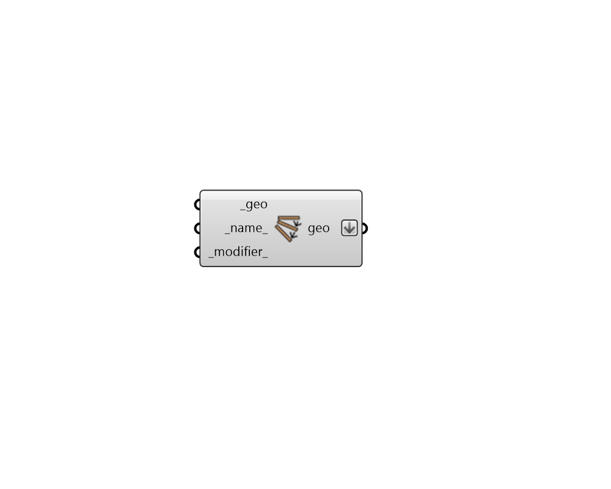

# Dynamic State Geometry

 - [\[source code\]](https://github.com/ladybug-tools/honeybee-grasshopper-radiance/blob/master/honeybee_grasshopper_radiance/src//HB%20Dynamic%20State%20Geometry.py)

Create a StateGeometry object that can be assigned to the shades\_ of a dynamic state using the "HB Dynamic State" component.

## Inputs

* **geo \[Required\]**

  Rhino Brep or Mesh geometry to be converted to StateGeometry. 

* **name**

  Text to set the name for the StateGeometry and to be incorporated into unique StateGeometry identifier. If the name is not provided, a random name will be assigned. 

* **modifier**

  A Honeybee Radiance Modifier object for the geometry. If None, it will be the Generic Exterior Shade modifier in the lib. \(Default: None\). 

## Outputs

* **geo**

  A Honeybee StateGeometry object representing planar geometry that can be assigned to Radiance states. This can be assigned using the "HB Dynamic State" component. 

