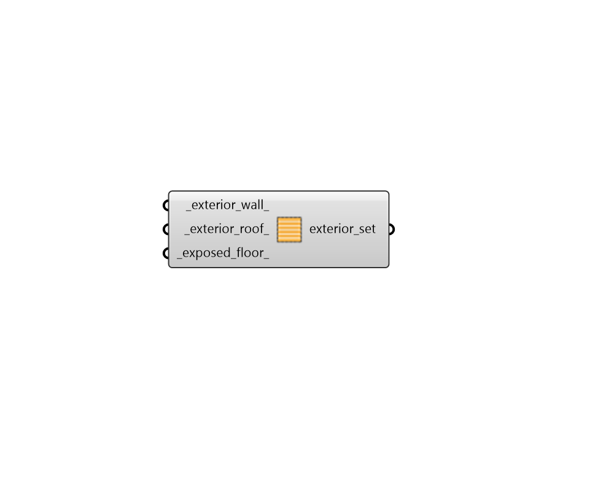

# Exterior Modifier Subset

 - [\[source code\]](https://github.com/ladybug-tools/honeybee-grasshopper-radiance/blob/master/honeybee_grasshopper_radiance/src//HB%20Exterior%20Modifier%20Subset.py)

Create a list of exterior modifiers that can be used to edit or create a ModifierSet object.

## Inputs

* **exterior\_wall**

  A modifier object for exterior walls \(or text for the identifier of the modifier within the library\). 

* **exterior\_roof**

  A modifier object for exterior roofs \(or text for the identifier of the modifier within the library\). 

* **exposed\_floor**

  A modifier object for exposed floors \(or text for the identifier of the modifier within the library\). 

## Outputs

* **exterior\_set**

  A list of exterior modifiers that can be used to edit or create a ModifierSet object. 

