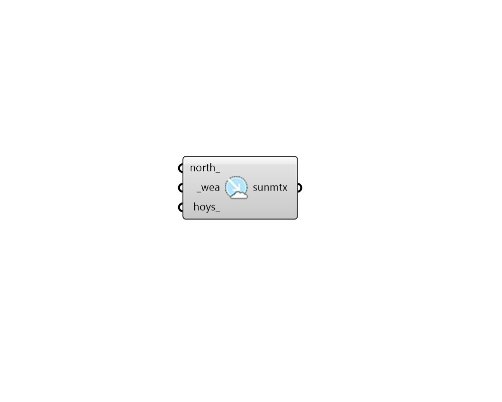

# Sun Matrix

 - [\[source code\]](https://github.com/ladybug-tools/honeybee-grasshopper-radiance/blob/master/honeybee_grasshopper_radiance/src//HB%20Sun%20Matrix.py)

Create a Sun Matrix from Wea.

## Inputs

* **north**

  A number between 0 and 360 that represents the degrees off from the y-axis to make North. This can also be a vector to set the North. Default is 0. The default North direction is the Y-axis \(0 degrees\). 

* **wea \[Required\]**

  Ladybug Wea object. 

* **hoys**

  Optional list of numbers for the hours of the year to be included in the sky matrix \[0-8759\]. 

## Outputs

* **sunmtx**

  Sky vector for multi-phase daylight analysis. 

