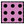

#### Component list:
*  [Face Radiance Attributes](../components/Face_Radiance_Attributes.md)
*  [Room Radiance Attributes](../components/Room_Radiance_Attributes.md)
*  [Dynamic Aperture Group](../components/Dynamic_Aperture_Group.md)
*  [Dynamic Shade Group](../components/Dynamic_Shade_Group.md)
*  [Dynamic State](../components/Dynamic_State.md)
*  [Dynamic State Geometry](../components/Dynamic_State_Geometry.md)
*  [Sensor Grid](../components/Sensor_Grid.md)
*  [Sensor Grid from Rooms](../components/Sensor_Grid_from_Rooms.md)
*  [View](../components/View.md)
*  [View from Viewport](../components/View_from_Viewport.md)
*  [Assign Grids and Views](../components/Assign_Grids_and_Views.md)
*  [Get Grids and Views](../components/Get_Grids_and_Views.md)
*  [Radial Grid from Rooms](../components/Radial_Grid_from_Rooms.md)
*  [Radial Sensor Grid](../components/Radial_Sensor_Grid.md)
*  [Section Plane View](../components/Section_Plane_View.md)