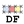

#### Component list:
*  [Annual Daylight](../components/Annual_Daylight.md)
*  [Annual Irradiance](../components/Annual_Irradiance.md)
*  [Point-In-Time Grid-Based](../components/Point-In-Time_Grid-Based.md)
*  [Point-In-Time View-Based](../components/Point-In-Time_View-Based.md)
*  [Cumulative Radiation](../components/Cumulative_Radiation.md)
*  [Daylight Factor](../components/Daylight_Factor.md)
*  [Direct Sun Hours](../components/Direct_Sun_Hours.md)
*  [Sky View](../components/Sky_View.md)
*  [Check Scene](../components/Check_Scene.md)
*  [Radiance Parameter](../components/Radiance_Parameter.md)