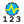
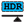
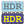
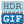
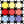

#### Component list:
*  [Annual Daylight Metrics](../components/Annual_Daylight_Metrics.md)
*  [Daylight Control Schedule](../components/Daylight_Control_Schedule.md)
*  [Spatial Daylight Autonomy](../components/Spatial_Daylight_Autonomy.md)
*  [Annual Average Values](../components/Annual_Average_Values.md)
*  [Annual Cumulative Values](../components/Annual_Cumulative_Values.md)
*  [Annual Peak Values](../components/Annual_Peak_Values.md)
*  [Annual Results to Data](../components/Annual_Results_to_Data.md)
*  [Adjust HDR](../components/Adjust_HDR.md)
*  [False Color](../components/False_Color.md)
*  [Glare Postprocess](../components/Glare_Postprocess.md)
*  [HDR to GIF](../components/HDR_to_GIF.md)
*  [Extract HDR](../components/Extract_HDR.md)
*  [Model to Rad Folder](../components/Model_to_Rad_Folder.md)