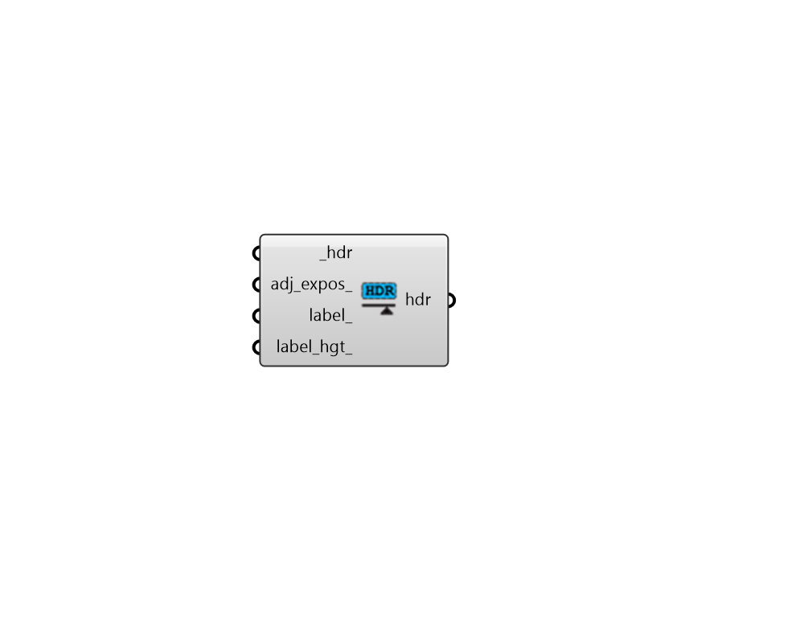

## Adjust HDR

 - [[source code]](https://github.com/ladybug-tools/honeybee-grasshopper-radiance/blob/master/honeybee_grasshopper_radiance/src//HB%20Adjust%20HDR.py)

Adjust and format a High Dynamic Range (HDR) image file. 

Possible adjustments include chaging the exposure of the image to mimic what would be seen by a human eye and adding an optional text label to the image. 

#### Inputs
* ##### hdr [Required]
Path to a High Dynamic Range (HDR) image file. 
* ##### adj_expos 
Boolean to note whether the exposure of the image should be adjusted to mimic the human visual response in the output. The goal of this process is to output an image that correlates more strongly with a person’s subjective impression of a scene rather than the absolute birghtness of the scene. (Default: False). 
* ##### label 
Optional text label to be appended to the bottom of the image. This is useful when one has several images and would like to easily identify them while scrolling through them. 
* ##### label_hgt 
An integer for the height of the label text in pixels. (Default: 32). 

#### Outputs
* ##### hdr
Path to the resulting adjusted HDR image file. 