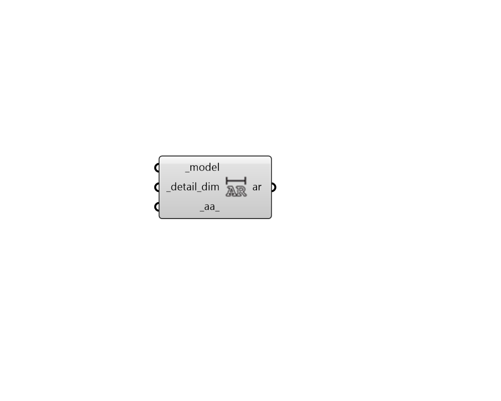

## Ambient Resolution

 - [[source code]](https://github.com/ladybug-tools/honeybee-grasshopper-radiance/blob/master/honeybee_grasshopper_radiance/src//HB%20Ambient%20Resolution.py)

Get the recommended ambient resoluation (-ar) needed to resolve details with a given dimension in model units. 

This recommendation is derived from the overall dimensions of the Radince scene being simulated as well as the ambient accuracy (-aa) being used in the simulation. 

The result from this component can be plugged directly into the additional_par_ of the "HB Radiance Parameter" component or into the radiance_par of any recipe components. 

#### Inputs
* ##### model [Required]
The Honeybee Model being used for Radiance simulation. 
* ##### detail_dim [Required]
A number in model units that represents the dimension of the smallest detail that must be resolved in the Radiance simulation. 
* ##### aa 
An number for ambient accuracy (-aa) being used in the Radiance smiulation. This value should be matched between this component and the component into which the ouput ar is being input. (Default: 0.25 for low-resolution Radiance studies). 

#### Outputs
* ##### ar
The abmient resolution needed to resolve the _detail_dim as a text string. These can be plugged into the additional_par_ of the "HB Radiance Parameter" component or the radiance_par_ input of the recipes. 