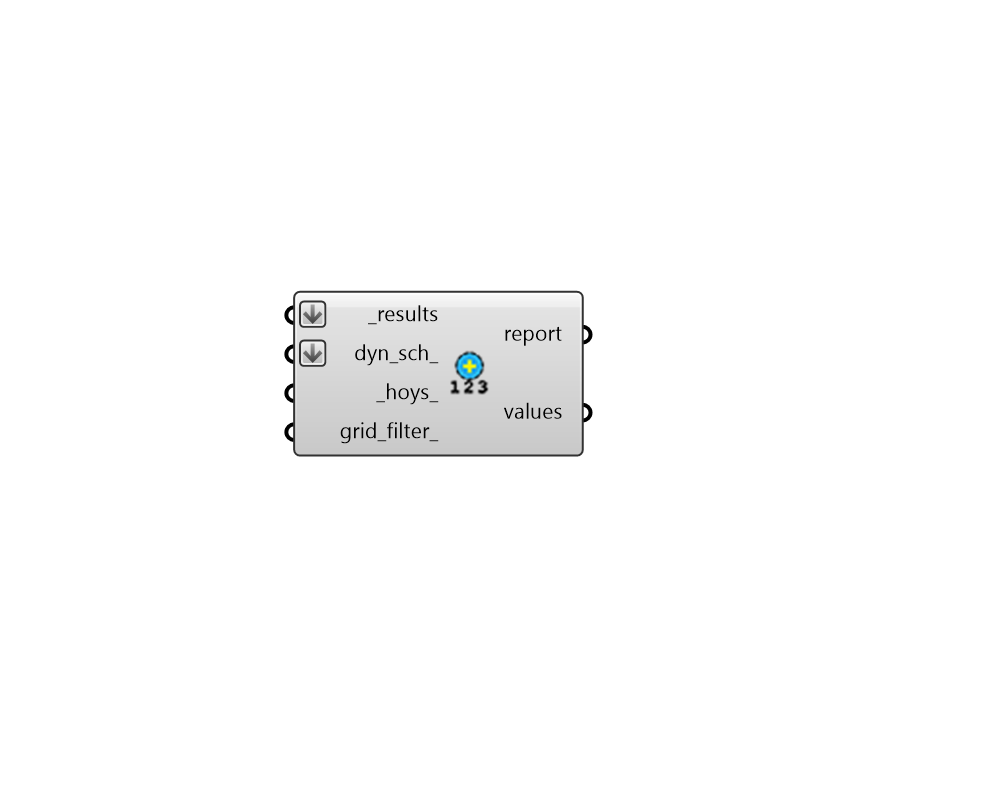

## Annual Cumulative Values

 - [[source code]](https://github.com/ladybug-tools/honeybee-grasshopper-radiance/blob/master/honeybee_grasshopper_radiance/src//HB%20Annual%20Cumulative%20Values.py)

Get cumulative radiation (or sum of illuminance) values over an annual irradiance or daylight simulation. 

The _hoys_ input can also be used to filter the data for a particular time period or hour/timestep of the simulation. 

#### Inputs
* ##### results [Required]
An list of annual Radiance result files from either the "HB Annual Daylight" or the "HB Annual Irradiance" component (containing the .ill files and the sun-up-hours.txt). This can also be just the path to the folder containing these result files. 
* ##### hoys 
An optional numbers or list of numbers to select the hours of the year (HOYs) for which results will be computed. These HOYs can be obtained from the "LB Calculate HOY" or the "LB Analysis Period" components. If None, all hours of the results will be used. 
* ##### grid_filter 
The name of a grid or a pattern to filter the grids. For instance, first_floor_* will simulate only the sensor grids that have an identifier that starts with first_floor_. By default all the grids will be processed. 

#### Outputs
* ##### report
Reports, errors, warnings, etc. 
* ##### values
In the case of an annual irradaince simulation, this is the cumulative radiation valules for each sensor in Wh/m2. For annual daylight, it is cumulative illuminance (lux-hours). These can be plugged into the "LB Spatial Heatmap" component along with meshes of the sensor grids to visualize results. 