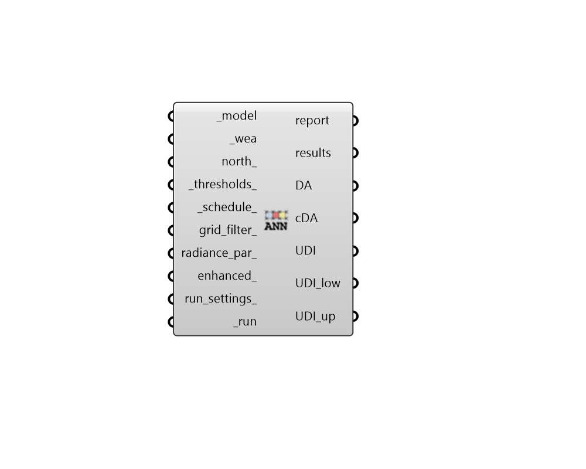

## Annual Daylight

 - [[source code]](https://github.com/ladybug-tools/honeybee-grasshopper-radiance/blob/master/honeybee_grasshopper_radiance/src//HB%20Annual%20Daylight.py)

Run an annual daylight study for a Honeybee model. 

#### Inputs
* ##### model [Required]
A Honeybee Model for which Annual Daylight will be simulated. Note that this model should have grids assigned to it in order to produce meaningfule results. 
* ##### wea [Required]
A Wea object produced from the Wea components that are under the Light Sources tab. This can also be the path to a .wea or a .epw file. 
* ##### north 
A number between -360 and 360 for the counterclockwise difference between the North and the positive Y-axis in degrees. This can also be Vector for the direction to North. (Default: 0). 
* ##### thresholds 
A string to change the threshold for daylight autonomy and useful daylight illuminance. Valid keys are -t for daylight autonomy threshold, 

    -lt for the lower threshold for useful daylight illuminance and

    -ut for the upper threshold. The order of the keys is not importantand you can include one or all of them. For instance if you only want to change the upper threshold to 2000 lux you should use -ut 2000 as the input. (Default: -t 300 -lt 100 -ut 3000). 
* ##### schedule 
An annual occupancy schedule, either as a Ladybug Hourly Continuous Data Collection or a HB-Energy schedule object. This can also be the path to a CSV file with 8760 rows or the identifier of a schedule in the honeybee-energy schedule library. Any value in this schedule that is 0.1 or above will be considered occupied. 
* ##### grid_filter 
Text for a grid identifer or a pattern to filter the sensor grids of the model that are simulated. For instance, first_floor_* will simulate only the sensor grids that have an identifier that starts with first_floor_. By default, all grids in the model will be simulated. 
* ##### sensor_count 
Integer for the maximum number of sensor grid points per parallel execution. (Default: 200). 
* ##### radiance_par 
Text for the radiance parameters to be used for ray tracing. (Default: -ab 2 -ad 5000 -lw 2e-05). 
* ##### run_settings 
Settings from the "HB Recipe Settings" component that specify how the recipe should be run. This can also be a text string of recipe settings. 
* ##### run [Required]
Set to True to run the recipe and get results. 

#### Outputs
* ##### report
Reports, errors, warnings, etc. 
* ##### results
Folder with raw result files (.ill) that contain illuminance matrices. 
* ##### DA
Daylight autonomy results. 
* ##### cDA
Continuous daylight autonomy results. 
* ##### UDI
Useful daylight illuminance results. 
* ##### UDI_low
Results for the percent of time that is below the lower threshold of useful daylight illuminance. 
* ##### UDI_up
Results for the percent of time that is above the upper threshold of useful daylight illuminance. 