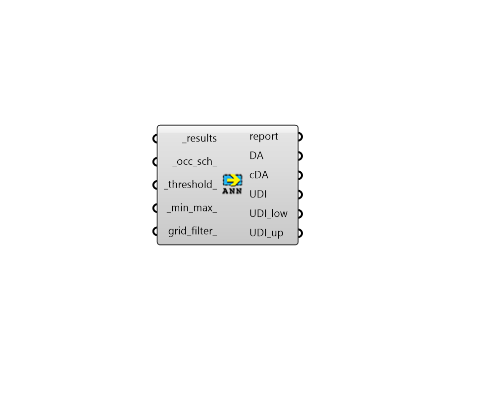

## Annual Daylight Metrics

 - [[source code]](https://github.com/ladybug-tools/honeybee-grasshopper-radiance/blob/master/honeybee_grasshopper_radiance/src//HB%20Annual%20Daylight%20Metrics.py)

Calculate Annual Daylight Metrics from a result (.ill) files. 

#### Inputs
* ##### results [Required]
An list of annual Radiance result files from the "HB Annual Daylight" component (containing the .ill files and the sun-up-hours.txt). This can also be just the path to the folder containing these result files. 
* ##### dyn_sch 
Optional dynamic Aperture Group Schedules from the "HB Aperture Group Schedule" component, which will be used to customize the behavior of any dyanmic aperture geometry in the output metrics. If unsupplied, all dynamic aperture groups will be in their default state in for the output metrics. 
* ##### occ_sch 
An annual occupancy schedule as a Ladybug Data Collection or a HB-Energy schedule object. This can also be the identifier of a schedule in your HB-Energy schedule library. Any value in this schedule that is 0.1 or above will be considered occupied. If None, a schedule from 9AM to 5PM on weekdays will be used. 
* ##### threshold 
Threshhold for daylight autonomy (DA) in lux (default: 300). 
* ##### min_max 
A list for min, max illuminacne thresholds for useful daylight illuminance in lux. (Default: (100, 3000)). 
* ##### grid_filter 
The name of a grid or a pattern to filter the grids. For instance, first_floor_* will simulate only the sensor grids that have an identifier that starts with first_floor_. By default all the grids will be processed. 

#### Outputs
* ##### report
Reports, errors, warnings, etc. 
* ##### DA
Daylight autonomy results in percent. DA is the percentage of occupied hours that each sensor recieves equal or more than the illuminance threshold. Each value is for a different sensor of the grid. These can be plugged into the "LB Spatial Heatmap" component along with meshes of the sensor grids to visualize results. These can also be connected to the "HB Spatial Daylight Autonomy" component to compute spatial daylight autonomy for each grid. 
* ##### cDA
Continuous daylight autonomy results in percent. cDA is similar to DA except that values below the illuminance threshold can still count partially towards the final percentage. Each value is for a different sensor of the grid. These can be plugged into the "LB Spatial Heatmap" component along with meshes of the sensor grids to visualize results. 
* ##### UDI
Useful daylight illuminance results in percent. UDI is the percentage of time that illuminace falls between minimum and maximum thresholds. Each value is for a different sensor of the grid. These can be plugged into the "LB Spatial Heatmap" component along with meshes of the sensor grids to visualize results. 
* ##### UDI_low
Results for the percent of time that is below the lower threshold of useful daylight illuminance in percent. Each value is for a different sensor of the grid. These can be plugged into the "LB Spatial Heatmap" component along with meshes of the sensor grids to visualize results. 
* ##### UDI_up
Results for the percent of time that is above the upper threshold of useful daylight illuminance in percent. Each value is for a different sensor of the grid. These can be plugged into the "LB Spatial Heatmap" component along with meshes of the sensor grids to visualize results. 