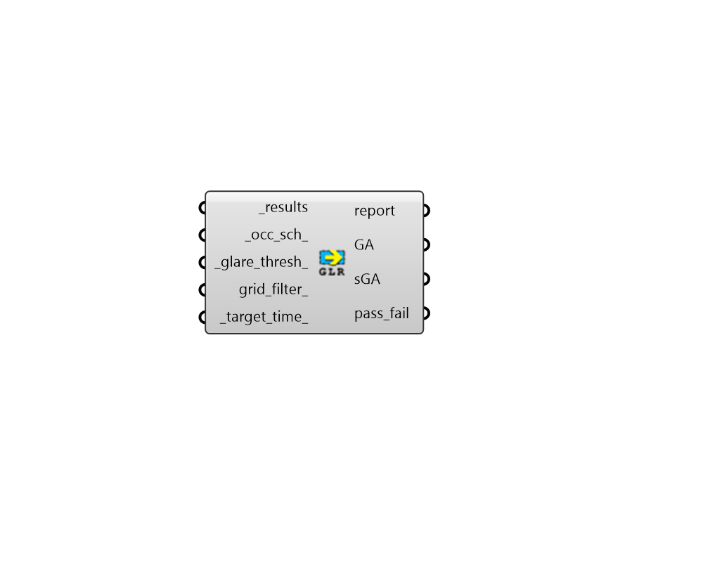

## Annual Glare Metrics

 - [[source code]](https://github.com/ladybug-tools/honeybee-grasshopper-radiance/blob/master/honeybee_grasshopper_radiance/src//HB%20Annual%20Glare%20Metrics.py)

Calculate Annual Glare Metrics from result (.dgp) files. 

Glare Autonmy is a metric describing the percentage of occupied hours that each sensor is below the glare threshold. 

Spatial Glare Autonomy is a metric describing the percentage of the sensor grid that is free glare according to the glare threshold and the target time. The sGA value is expressed as a percentage of the sensors in the analysis grid. 

#### Inputs
* ##### results [Required]
An list of annual Radiance result files from the "HB Imageless Annual Glare" component (containing the .dgp files and the sun-up-hours.txt). This can also be just the path to the folder containing these result files. 
* ##### occ_sch 
An annual occupancy schedule as a Ladybug Data Collection or a HB-Energy schedule object. This can also be the identifier of a schedule in your HB-Energy schedule library. Any value in this schedule that is 0.1 or above will be considered occupied. If None, a schedule from 8AM to 6PM on all days will be used. 
* ##### glare_thresh 
Threshold for glare autonomy (GA) in DGP (default: 0.4). 
* ##### grid_filter 
The name of a grid or a pattern to filter the grids. For instance, first_floor_* will simulate only the sensor grids that have an identifier that starts with first_floor_. By default all the grids will be processed. 
* ##### target_time 
A minimum threshold of occupied time (eg. 95% of the time), above which a given sensor passes and contributes to the spatial glare autonomy. (Default: 95%). 

#### Outputs
* ##### report
Reports, errors, warnings, etc. 
* ##### GA
Glare autonomy results in percent. GA is the percentage of occupied hours that each sensor is free of glare according to the glare threshold. Each value is for a different sensor of the grid. These can be plugged into the "LB Spatial Heatmap" component along with meshes of the sensor grids to visualize results. 
* ##### sGA
Spatial glare autonomy as a percentage of the sensors for each analysis grid that does not exceed the glare threshold for a specified fraction of occupied hours, ie. the target time. 
* ##### pass_fail
A data tree of zeros and ones, which indicate whether a given sensor passes the criteria for being free of glare (1) or fails the criteria (0). Being free of glare does not necessarily mean that the sensor is glare-free for all hours, but that it is glare-free for a minimum percentage of occupied hours defined by the target time. Each value is for a different sensor of the grid. These can be plugged into the "LB Spatial Heatmap" component along with meshes of the sensor grids to visualize results. 