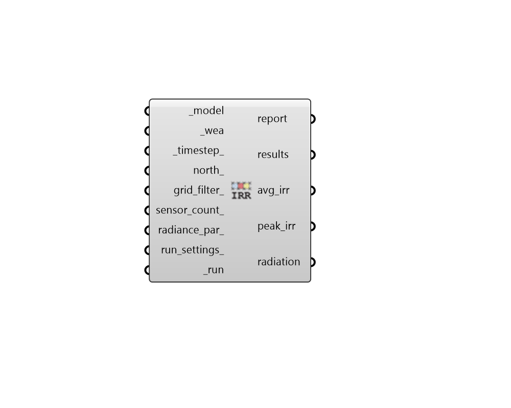

## Annual Irradiance

 - [[source code]](https://github.com/ladybug-tools/honeybee-grasshopper-radiance/blob/master/honeybee_grasshopper_radiance/src//HB%20Annual%20Irradiance.py)

Run an annual irradiance study for a Honeybee model to compute hourly solar irradiance for each sensor in a model's sensor grids. 

The fundamental calculation of this recipe is the same as that of "HB Annual Daylight" in that an enhaced 2-phase method is used to accurately account for direct sun at each simulation step. However, this recipe computes broadband solar irradiance in W/m2 instead of visible illuminance in lux. 

Consequently, the average irradiance and cumulative radiation values produced from this recipe are more accurate than those produced by the "HB Cumulative Radiation" recipe. Furthermore, because the hourly irriadiance values are accurate, this recipe can be used to evaluate `peak_irradiance` and determine the worst-case solar loads over clear sky Weas that represent cooling design days. 

#### Inputs
* ##### model [Required]
A Honeybee Model for which Annual Irradiance will be simulated. Note that this model must have grids assigned to it. 
* ##### wea [Required]
A Wea object produced from the Wea components that are under the Light Sources tab. This can also be the path to a .wea or a .epw file. 
* ##### timestep 
An integer for the timestep of the inpput _wea. This value is used to compute average irradiance and cumulative radiation. (Default: 1) 
* ##### north 
A number between -360 and 360 for the counterclockwise difference between the North and the positive Y-axis in degrees. This can also be Vector for the direction to North. (Default: 0). 
* ##### grid_filter 
Text for a grid identifer or a pattern to filter the sensor grids of the model that are simulated. For instance, first_floor_* will simulate only the sensor grids that have an identifier that starts with first_floor_. By default, all grids in the model will be simulated. 
* ##### sensor_count 
Integer for the maximum number of sensor grid points per parallel execution. (Default: 200). 
* ##### radiance_par 
Text for the radiance parameters to be used for ray tracing. (Default: -ab 2 -ad 5000 -lw 2e-05). 
* ##### run_settings 
Settings from the "HB Recipe Settings" component that specify how the recipe should be run. This can also be a text string of recipe settings. 
* ##### run [Required]
Set to True to run the recipe and get results. This input can also be the integer "2" to run the recipe silently. 

#### Outputs
* ##### report
Reports, errors, warnings, etc. 
* ##### results
Raw result files (.ill) that contain matrices of irradiance in W/m2 for each time step of the wea. 
* ##### avg_irr
The average irradiance in W/m2 for each sensor over the Wea time period. 
* ##### peak_irr
The highest irradiance value in W/m2 during the Wea time period. This is suitable for assessing the worst-case solar load of clear skies on cooling design days. It can also be used to determine the highest radiant temperatures that occupants might experience in over the time period of the Wea. 
* ##### radiation
The cumulative radiation in kWh/m2 over the Wea time period. 