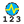

## Annual Peak Values

 - [[source code]](https://github.com/ladybug-tools/honeybee-grasshopper-radiance/blob/master/honeybee_grasshopper_radiance/src//HB%20Annual%20Peak%20Values.py)

Get peak irradiance or sum of illuminance values over an annual irradiance or daylight simulation. 

The _hoys_ input can also be used to filter the data for a particular time period or hour/timestep of the simulation. 

#### Inputs
* ##### results [Required]
An list of annual Radiance result files from either the "HB Annual Daylight" or the "HB Annual Irradiance" component (containing the .ill files and the sun-up-hours.txt). This can also be just the path to the folder containing these result files. 
* ##### dyn_sch 
Optional dynamic Aperture Group Schedules from the "HB Aperture Group Schedule" component, which will be used to customize the behavior of any dyanmic aperture geometry in the output metrics. If unsupplied, all dynamic aperture groups will be in their default state in for the output metrics. 
* ##### hoys 
An optional numbers or list of numbers to select the hours of the year (HOYs) for which results will be computed. These HOYs can be obtained from the "LB Calculate HOY" or the "LB Analysis Period" components. If None, all hours of the results will be used. 
* ##### grid_filter 
The name of a grid or a pattern to filter the grids. For instance, first_floor_* will simulate only the sensor grids that have an identifier that starts with first_floor_. By default all the grids will be processed. 
* ##### coincident 
Boolean to indicate whether output values represent the the peak value for each sensor throughout the entire analysis (False) or they represent the highest overall value across each sensor grid at a particular timestep (True). (Default: False). 

#### Outputs
* ##### report
Reports, errors, warnings, etc. 
* ##### hoys
An integer for each sesnor grid that represents the hour of the year at which the peak occurs. This will be None unless coincident_ is set to True. 
* ##### values
Peak illuminance or irradiance valules for each sensor in lux or W/m2. Each value is for a different sensor of the grid. These can be plugged into the "LB Spatial Heatmap" component along with meshes of the sensor grids to visualize results. 