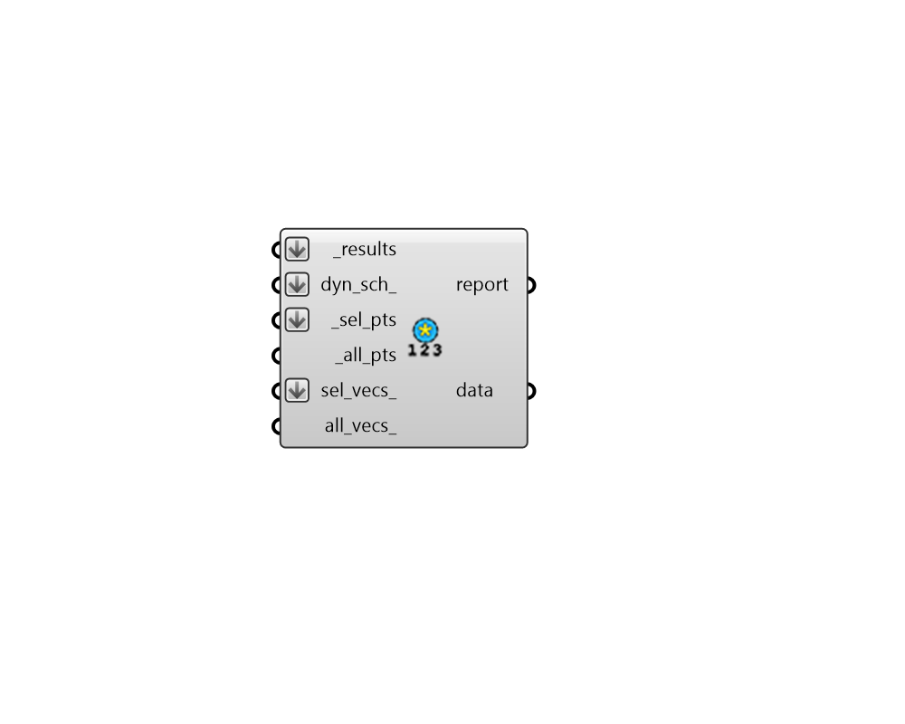

## Annual Results to Data

 - [[source code]](https://github.com/ladybug-tools/honeybee-grasshopper-radiance/blob/master/honeybee_grasshopper_radiance/src//HB%20Annual%20Results%20to%20Data.py)

Import the hourly illuminance or irradiance results of an annual daylight or irradiance study to a list of data collections. 

The resulting data collections can be visulized using the ladybug components or deconstructed for detailed analysis with native Grasshopper math components. 

#### Inputs
* ##### results [Required]
An list of annual Radiance result files from the "HB Annual Daylight" component (containing the .ill files and the sun-up-hours.txt). This can also be just the path to the folder containing these result files. 
* ##### sel_pts 
An optional point or list of points, which will be used to filter the sensors for which data collections will be imported. If there is an input here, the all_pts_ must be connected. 
* ##### all_pts 
The data tree of all sensor points that were used in the simulation. This is required in order to look up the index of the sel_pts_ in the results matrices. 

#### Outputs
* ##### report
Reports, errors, warnings, etc. 
* ##### data
A list of hourly data collections containing illuminance or irradiance results. These can be visulized using the ladybug components or deconstructed for detailed analysis with native Grasshopper math components. 