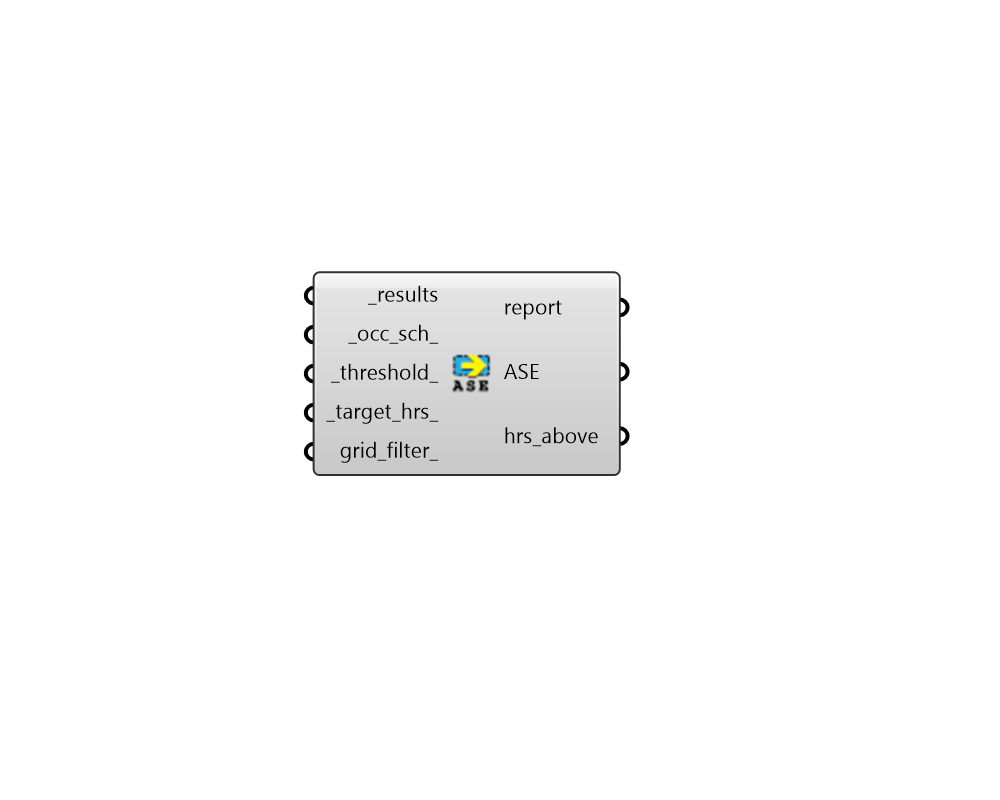

## Annual Sunlight Exposure

 - [[source code]](https://github.com/ladybug-tools/honeybee-grasshopper-radiance/blob/master/honeybee_grasshopper_radiance/src//HB%20Annual%20Sunlight%20Exposure.py)

Calculate Annual Sunlight Exposure from a results folder. 

Note: This component will only output a LEED compliant ASE if you've run the simulation with all operable shading devices retracted. If you are using results with operable shading devices, then this output is NOT LEED compliant. 

#### Inputs
* ##### results [Required]
An annual results folder containing direct illuminance results. This can be the output of the "HB Annual Daylight" component. This can also be just the path to the results folder. 
* ##### occ_sch 
An annual occupancy schedule as a Ladybug Data Collection or a HB-Energy schedule object. This can also be the identifier of a schedule in your HB-Energy schedule library. Any value in this schedule that is 0.1 or above will be considered occupied. If None, a schedule from 9AM to 5PM on weekdays will be used. 
* ##### threshold 
The threshold (lux) that determines if a sensor is overlit (default: 1000). 
* ##### target_hrs 
The number of occupied hours that cannot receive higher illuminance than the direct threshold (default: 250). 
* ##### grid_filter 
The name of a grid or a pattern to filter the grids. For instance, first_floor_* will simulate only the sensor grids that have an identifier that starts with first_floor_. By default all the grids will be processed. 

#### Outputs
* ##### report
Reports, errors, warnings, etc. 
* ##### ASE
Annual sunlight exposure as a percentage for each sensor grid. 
* ##### hrs_above_thresh
The number of hours above the threshold for each sensor point. These can be plugged into the "LB Spatial Heatmap" component along with meshes of the sensor grids to visualize results. 