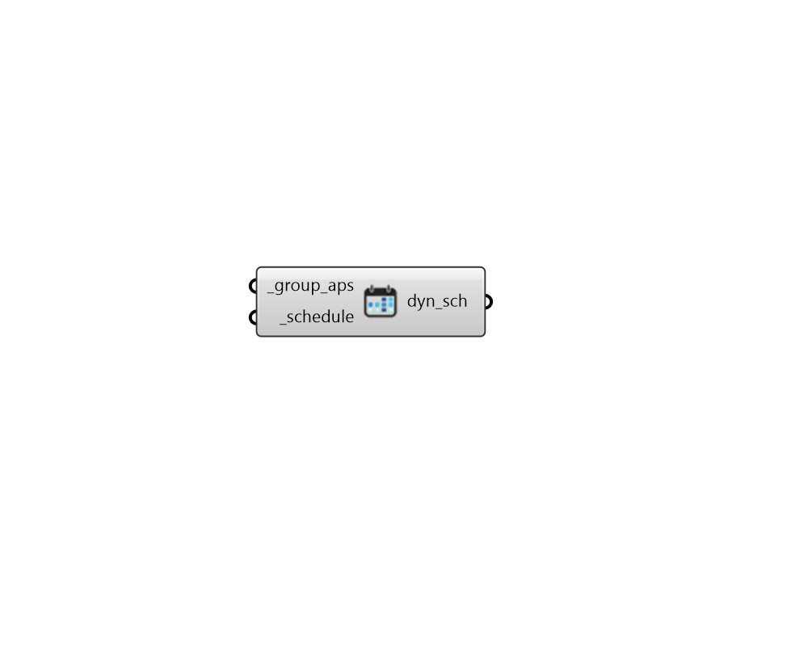

## Aperture Group Schedule

 - [[source code]](https://github.com/ladybug-tools/honeybee-grasshopper-radiance/blob/master/honeybee_grasshopper_radiance/src//HB%20Aperture%20Group%20Schedule.py)

Create a Dynamic Aperture Group Schedule, which can be used to process any dynamic aperture geometry that was run in an annual simulation. 

#### Inputs
* ##### group_aps [Required]
Honeybee Apertures that are a part of the same dynamic group and will be assigned the same schedule for postprocessing. Typically, this is the output of the "HB Dynamic Aperture Group" component but it can also be the output of the "HB Get Dynamic Groups" component, which returns all of the dynamic groups on a particular Model. 
* ##### schedule [Required]
A list of 8760 integers refering to the index of the aperture group state to be used at each hour of the simulation. This can also be a single integer for a static state to be used for the entire period of the simulation or a pattern of integers that is less than 8760 in length and will be repeated until the 8760 is reached. Note that 0 refers to the first state, 1 refers to the second state, and so on. -1 can be used to completely discout the aperture from the simulation for a given hour. 

#### Outputs
* ##### dyn_sch
A dynamic schedule object for the input aperture group, which can be plugged into any of the Results components with a syn_sch input. 