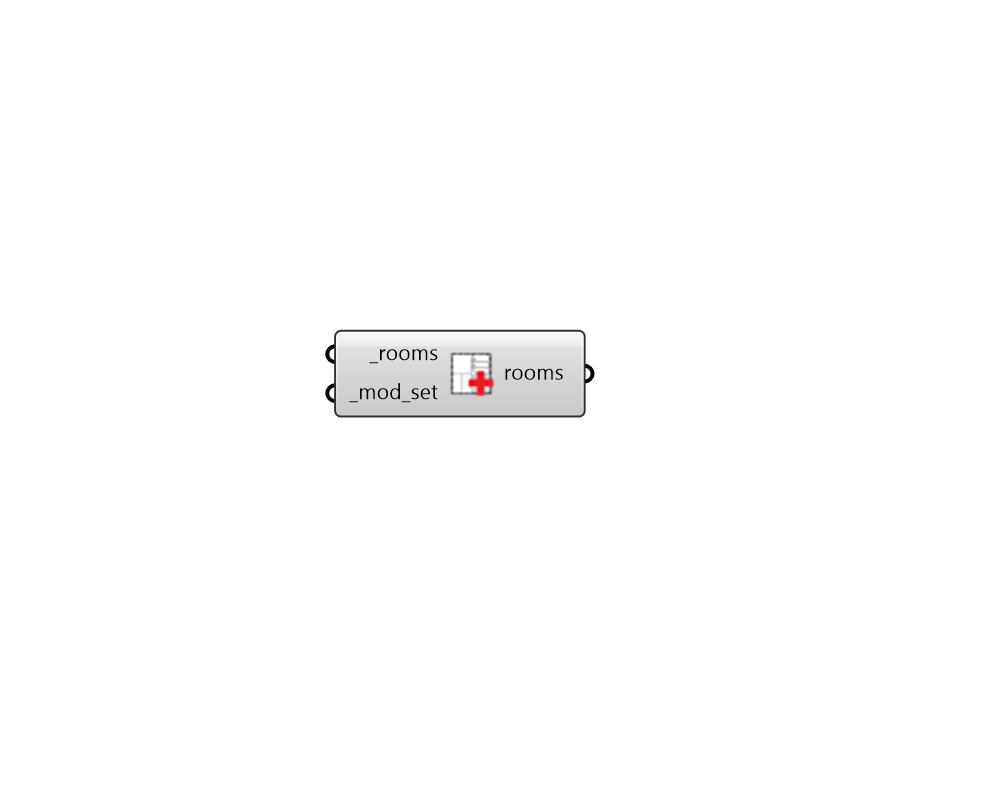

## Apply ModifierSet

 - [[source code]](https://github.com/ladybug-tools/honeybee-grasshopper-radiance/blob/master/honeybee_grasshopper_radiance/src//HB%20Apply%20ModifierSet.py)

Apply ModifierSet to Honeybee Rooms. 

#### Inputs
* ##### rooms [Required]
Honeybee Rooms to which the input _mod_set should be assigned. 
* ##### mod_set [Required]
A Honeybee ModifierSet to be applied to the input _room. This can also be text for a modifier set to be looked up in the modifier set library. 

#### Outputs
* ##### rooms
The input Rooms with their modifier sets edited. 