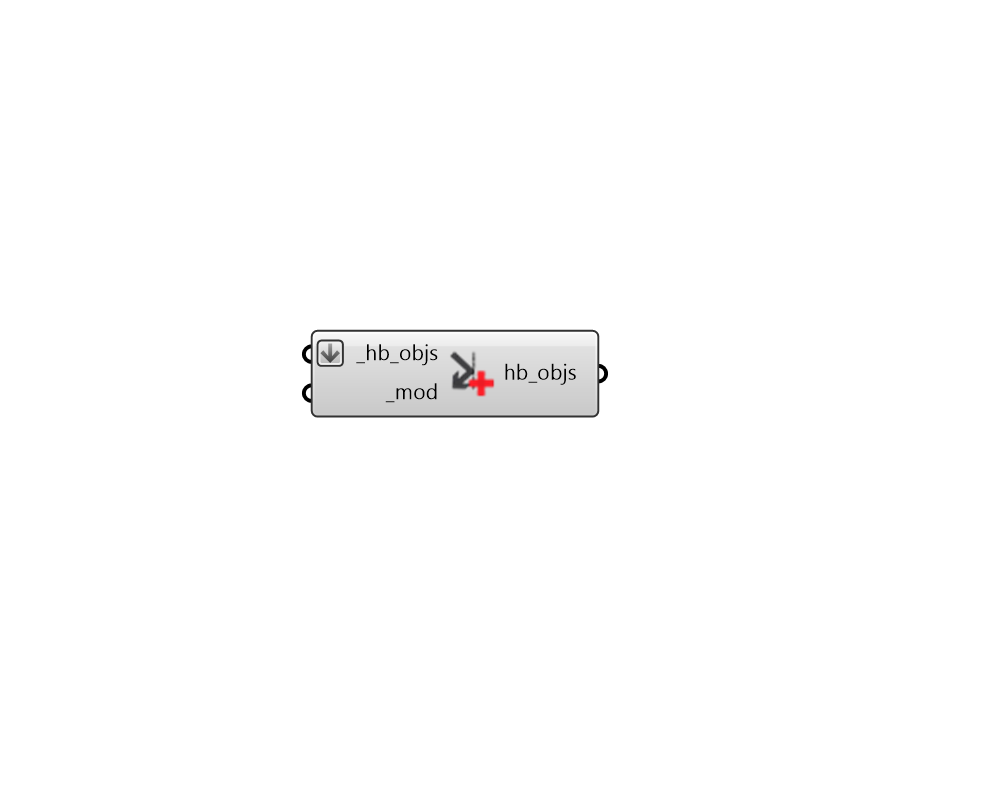

## Apply Shade Modifier

 - [[source code]](https://github.com/ladybug-tools/honeybee-grasshopper-radiance/blob/master/honeybee_grasshopper_radiance/src//HB%20Apply%20Shade%20Modifier.py)

Apply a Modifier to Honeybee Shade objects. Alternatively, it can assign a Modifier to all of the child shades of an Aperture, Door, Face, or a Room. 

This component supports the assigning of different modifiers based on cardinal orientation, provided that a list of Modifiers are input to the _mod.  

#### Inputs
* ##### hb_objs [Required]
Honeybee Shades, Apertures, Doors, Faces, Rooms, or a Model to which the input _mod should be assigned. For the case of a Honeybee Aperture, Door, Face, Room or Model, the Modifier will be assigned to only the child shades directly assigned to that object. So passing in a Room will not change the modifier of shades assigned to Apertures of the Room's Faces. If this is the desired outcome, then the Room should be deconstructed into its child objects before using this component. 
* ##### mod [Required]
A Honeybee Modifier to be applied to the input _hb_objs. This can also be text for a modifier to be looked up in the shade modifier library. If an array of text or modifier objects are input here, different modifiers will be assigned based on cardinal direction, starting with north and moving clockwise. 

#### Outputs
* ##### hb_objs
The input honeybee objects with their modifiers edited. 