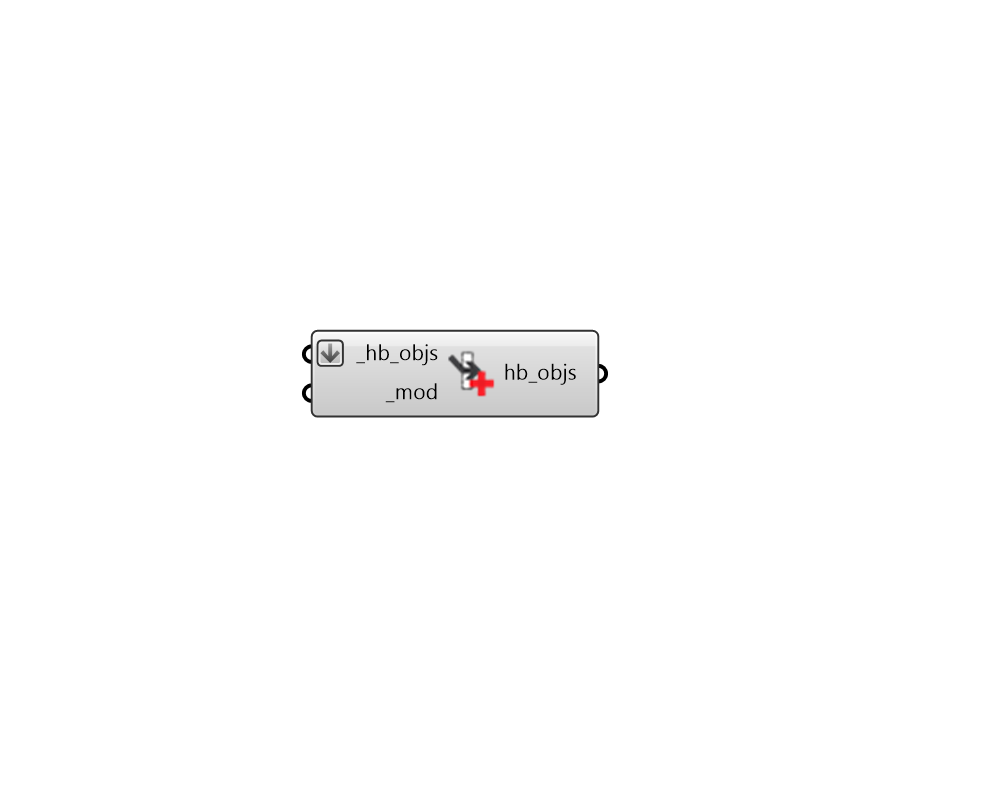

## Apply Window Modifier

 - [[source code]](https://github.com/ladybug-tools/honeybee-grasshopper-radiance/blob/master/honeybee_grasshopper_radiance/src//HB%20Apply%20Window%20Modifier.py)

Apply Modifier to Honeybee Apertures or glass Doors. Alternatively, it can assign Modifiers to the child apertures of input Faces or the apertures within Room walls. 

This component supports the assigning of different modifiers based on cardinal orientation, provided that a list of Modifiers are input to the _mod.  

#### Inputs
* ##### hb_objs [Required]
Honeybee Apertures, Faces, Doors or Rooms to which the input _mod should be assigned. For the case of a Honeybee Room, the modifier will only be applied to the apertures in the the Room's outdoor walls. Note that, if you need to assign a modifier to all the skylights, glass doors, etc. of a Room, the best practice is to create a ModifierSet and assing that to the Room. 
* ##### mod [Required]
A Honeybee Modifier to be applied to the input _hb_objs. This can also be text for a modifier to be looked up in the window modifier library. If an array of text or modifier objects are input here, different modifiers will be assigned based on cardinal direction, starting with north and moving clockwise. 

#### Outputs
* ##### hb_objs
The input honeybee objects with their modifiers edited. 