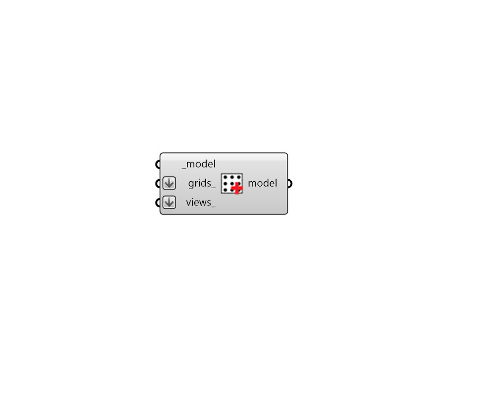

## Assign Grids and Views

 - [[source code]](https://github.com/ladybug-tools/honeybee-grasshopper-radiance/blob/master/honeybee_grasshopper_radiance/src//HB%20Assign%20Grids%20and%20Views.py)

Add radiance Sensor Grids and/or Views to a Honeybee Model. 

This assignment is necessary for any Radiance study, though whether a grid or a view is required for a particular type of study is depenednet upon the recipe used. 

Multiple copies of this component can be used in series and each will add the grids or views to any that already exist. 

#### Inputs
* ##### model [Required]
A Honeybee Model to which the input grids_ and views_ will be assigned. 
* ##### grids 
A list of Honeybee-Radiance SensorGrids, which will be assigned to the input _model. 
* ##### views 
A list of Honeybee-Radiance Views, which will be assigned to the input _model. 

#### Outputs
* ##### model
The input Honeybee Model with the grids_ and views_ assigned to it. 