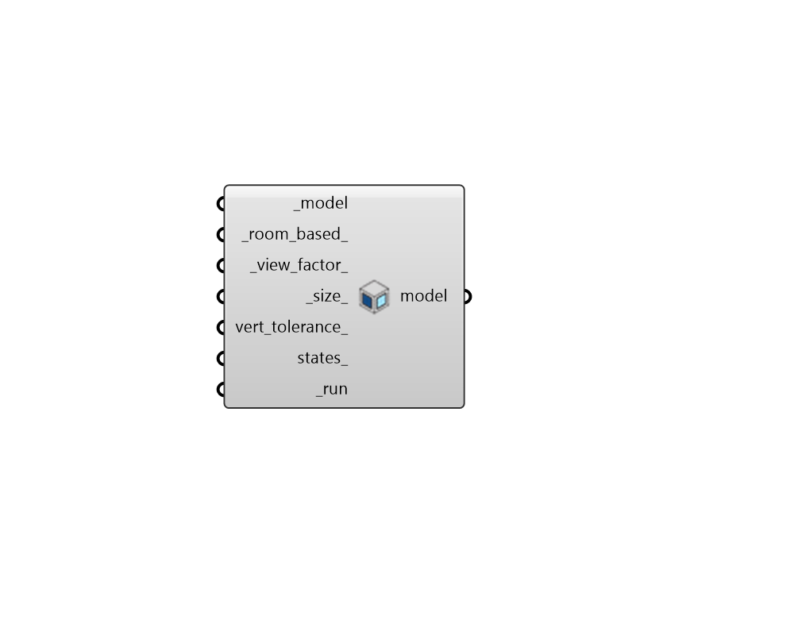

## Automatic Aperture Group

 - [[source code]](https://github.com/ladybug-tools/honeybee-grasshopper-radiance/blob/master/honeybee_grasshopper_radiance/src//HB%20Automatic%20Aperture%20Group.py)

Calculate Aperture groups for exterior Apertures. 

The Apertures are grouped by orientation unless _view_factor_ is set to True. 

If grouping based on view factor the component calculates view factor from Apertures to sky patches (rfluxmtx). Each Aperture is represented by a sensor grid, and the view factor for the whole Aperture is the average of the grid. The RMSE of the view factor to each sky patch is calculated between all Apertures. Agglomerative hierarchical clustering (with complete-linkage method) is used to group the Apertures by using a distance matrix of the RMSE values. The view factor approach is Radiance-based (and slower) and will likely group Apertures more accurately considering the context geometry of the Honeybee Model. 

#### Inputs
* ##### model [Required]
A Honeybee Model for which Apertures will be grouped automatically. Note that this model must have Apertures with Outdoors boundary condition assigned to it. 
* ##### room_based 
A boolean to note whether the Apertures should be grouped on a room basis. If grouped on a room basis Apertures from different room cannot be in the same group. (Default: True). 
* ##### view_factor 
A boolean to note whether the Apertures should be grouped by calculating view factors for the Apertures to a discretized sky or simply by the normal orientation of the Apertures. (Default: False). 
* ##### size 
Aperture grid size for view factor calculation. A lower number will give a finer grid and more accurate results but the calculation time will increase. This option is only used if _view_factor_ is set to True. (Default: 0.2). 
* ##### vert_tolerance 
A float value for vertical tolerance between two Apertures. If the vertical distance between two Apertures is larger than this tolerance the Apertures cannot be grouped. If no value is given the vertical grouping will be skipped. (Default: None). 
* ##### states 
An optional list of Honeybee State objects to be applied to all the generated groups. These states should be ordered based on how they will be switched on. The first state is the default state and, typically, higher states are more shaded. If the objects in the group have no states, the modifiers already assigned the apertures will be used for all states. 
* ##### run [Required]
Set to True to run the automatic Aperture grouping. 

#### Outputs
* ##### model
The input Honeybee Model object where all Apertures with Outdoors boundary condition have been assigned a dynamic group identifier. 