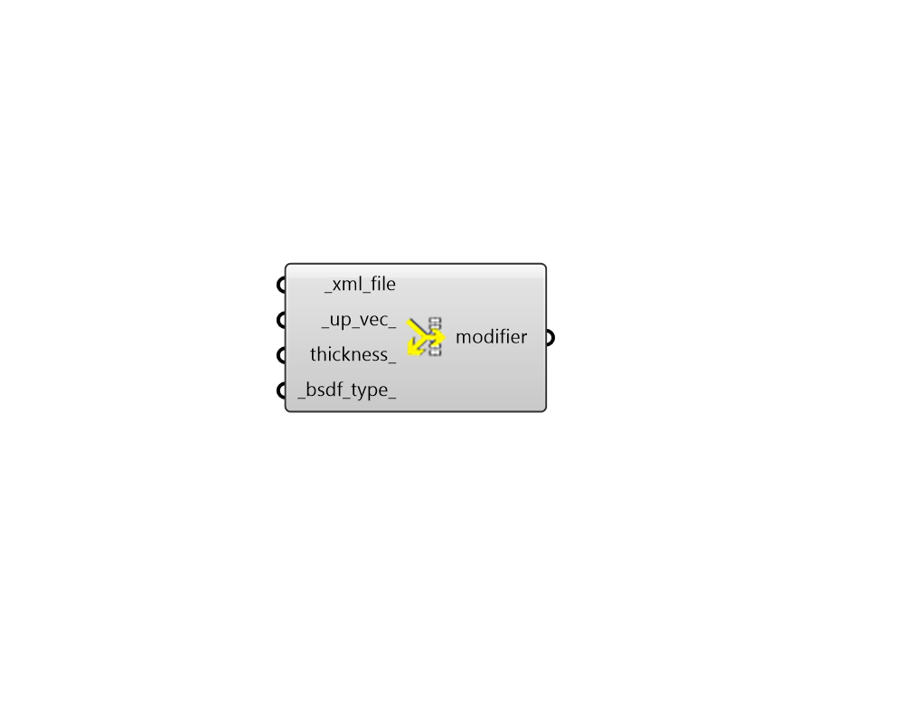

## BSModifier

 - [[source code]](https://github.com/ladybug-tools/honeybee-grasshopper-radiance/blob/master/honeybee_grasshopper_radiance/src//HB%20BSDF%20Modifier.py)

Create a Bidirectional Scattering Distribution Function (BSDF) radiance modifier from an XML file. 

#### Inputs
* ##### xml_file [Required]
Path to an XML file contining BSDF data. These files can be produced using the LBNL WINDOW software among other sources. 
* ##### up_vec 
A vector that sets the hemisphere that the BSDF modifier faces. For materials that are symmetrical about the face plane (like non-angled venetian blinds), this can be any vector that is not perfectly normal/perpendicular to the face. For asymmetrica materials like angled venetian blinds, this variable should be coordinated with the direction that the geometry is facing. The default is set to (0.01, 0.01, 1.00), which should hopefully not be normal to any typical face. 
* ##### thickness 
Optional number to set the thickness of the BSDF. (Default: 0). 

#### Outputs
* ##### modifier
A BSDF modifier that can be assigned to a Honeybee geometry or Modifier Sets. 