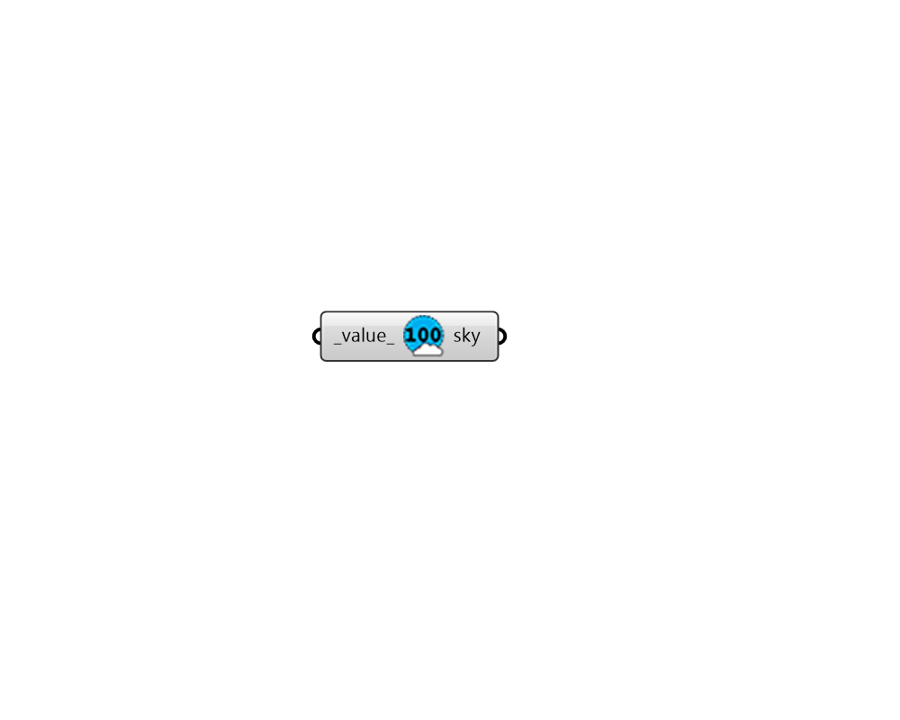

## Certain Illuminance

 - [[source code]](https://github.com/ladybug-tools/honeybee-grasshopper-radiance/blob/master/honeybee_grasshopper_radiance/src//HB%20Certain%20Illuminance.py)

Create a uniform sky that yields a certain illuminance. 

#### Inputs
* ##### value 
Desired value for sky horizontal illuminance in lux. (Default: 10000). 

#### Outputs
* ##### sky
A honeybee sky that can be used to create a point-in-time recipe. 