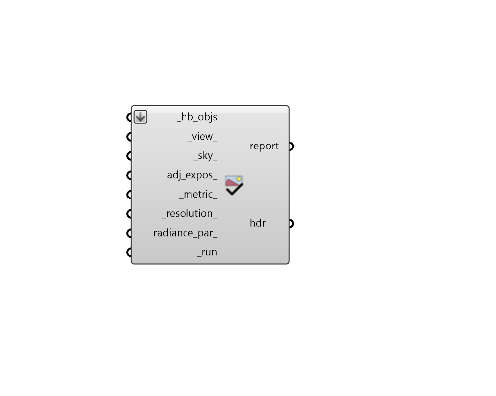

## Check Scene

 - [[source code]](https://github.com/ladybug-tools/honeybee-grasshopper-radiance/blob/master/honeybee_grasshopper_radiance/src//HB%20Check%20Scene.py)

Run a quick view-based Radiance simulation to visualize the properties of Honeybee objects within Radiance. 

Note that this simulation is always run on a single processor and will only show static Radiance properties (no dynamic Aperture or Shade properties). Accordingly, this component is only intended for quick checks of properties. For full customization of view-based simulations, the "HB Point-in-time View-based" recipe should be used. 

#### Inputs
* ##### hb_objs [Required]
An array of honeybee Rooms, Faces, Apertures, Doors or Shades to be visualized in Radiance. This can also be an entire Model to be visualized. 
* ##### view 
An optional Honeybee-Radiance view to specify the view to render. If unspecified, the currently active Rhino viewport will be rendered. 
* ##### sky 
An optional Radiance sky from any of the sky components under the "Light Sources" tab. If unspecified, a uniform sky with 10000 lux will be used. 
* ##### adj_expos 
Boolean to note whether the exposure of the image should be adjusted to mimic the human visual response in the output. The goal of this process is to output an image that correlates more strongly with a person’s subjective impression of a scene rather than the absolute birghtness of the scene. (Default: True). 
* ##### metric 
Either an integer or the full name of a point-in-time metric to be computed by the recipe. (Default: luminance). Choose from the following: 

    * 0 = illuminance

    * 1 = irradiance

    * 2 = luminance

    * 3 = radiance
* ##### resolution 
An integer for the maximum dimension of each image in pixels (either width or height depending on the input view angle and type). (Default: 800). 
* ##### radiance_par 
Text for the radiance parameters to be used for ray tracing. (Default: -ab 2 -aa 0.25 -ad 512 -ar 16). 
* ##### run [Required]
Set to "True" to run Radiance and get an image of the scene. 

#### Outputs
* ##### report
Reports, errors, warnings, etc. 
* ##### hdr
A High Dynamic Range (HDR) image of the scene. This can be plugged into the Ladybug "Image Viewer" component to preview the image. It can also be plugged into the "HB False Color" component to convert the image into a false color version. Lastly, it can be connected to the "HB HDR to GIF" component to get a GIF image that is more portable and easily previewed by different software. Pixel values are in the standard SI units of the requested input metric. 

    * illuminance = lux (aka. lm/m2)

    * irradiance = W/m2

    * luminance = cd/m2 (aka. lm/m2-sr)

    * radiance = W/m2-sr