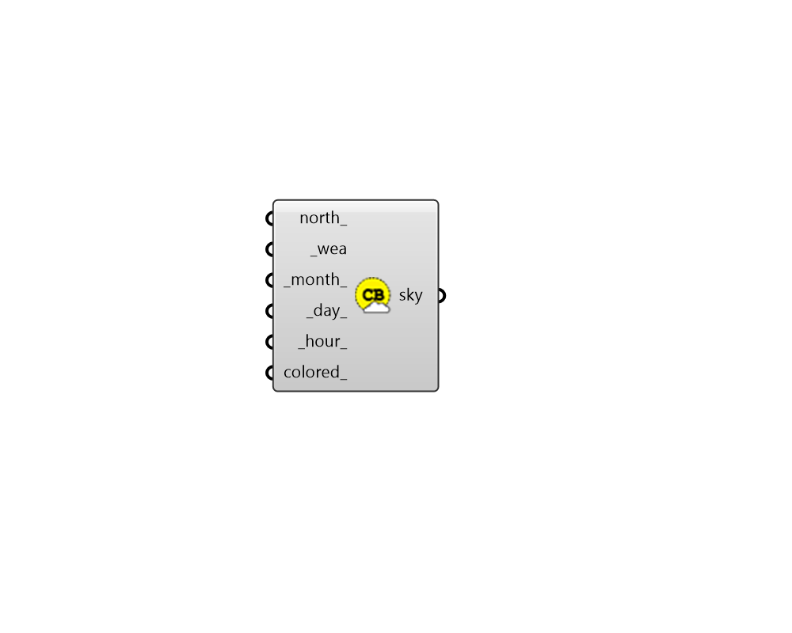

## Climatebased Sky

 - [[source code]](https://github.com/ladybug-tools/honeybee-grasshopper-radiance/blob/master/honeybee_grasshopper_radiance/src//HB%20Climatebased%20Sky.py)

Create a point-in-time climate-based sky from a Wea. 

#### Inputs
* ##### north 
A number between 0 and 360 that represents the degrees off from the y-axis to make North. This can also be a vector to set the North. Default is 0. The default North direction is the Y-axis (0 degrees). 
* ##### wea [Required]
A Ladybug Wea object. 
* ##### month 
An integer between 1 and 12 for the month of the year (default: 6). 
* ##### day 
An integer between 1 and 31 for the day of the month (default: 21). 
* ##### hour 
A number between 0 and 23.999.. for the hour of the day (default: 12). 

#### Outputs
* ##### sky
A Honeybee sky that can be used to create a point-in-time recipe. 