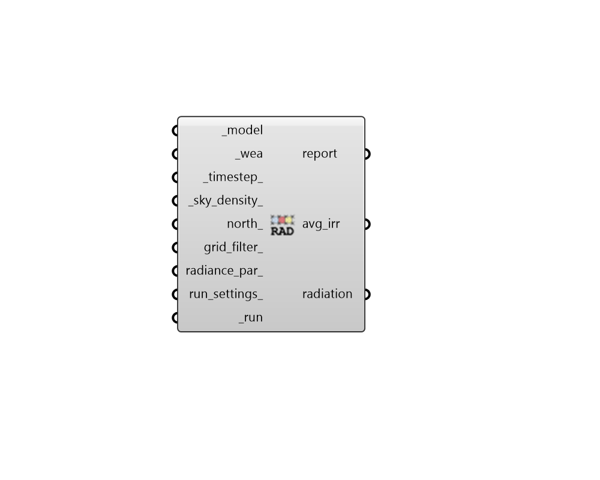

## Cumulative Radiation

 - [[source code]](https://github.com/ladybug-tools/honeybee-grasshopper-radiance/blob/master/honeybee_grasshopper_radiance/src//HB%20Cumulative%20Radiation.py)

Run a cumulative radiation study for a Honeybee model. 

This recipe calculates cumulative radiation (kWh/m2) and average irradiance (W/m2) over the time period of a specified Wea. 

The fundamental calculation of this recipe is the same as that of the "LB Incident Radiation" component except that this recipe uses Radiance and can therefore account for ambient reflections. Like LB Incident Radiation, the direct sun in this recipe is diffused between several sky patches and so the precise line between shadow and sun for each hour is blurred. This approximation is acceptable for studies where one is only concerned about the average/total conditions over time and the timestep-by-timestep irradiance values do not need to be exact. For accurate modeling of direct irradiance on a timestep-by-timestep basis, see the "HB Annual Irradiance" recipe. 

#### Inputs
* ##### model [Required]
A Honeybee Model for which Cumulative Radiation will be simulated. Note that this model should have grids assigned to it. 
* ##### wea [Required]
A Wea object produced from the Wea components that are under the Light Sources tab. This can also be the path to a .wea or a .epw file. 
* ##### timestep 
An integer for the timestep of the inpput _wea. (Default: 1) 
* ##### sky_density 
An integer for the number of times that that the original Tregenza sky patches are subdivided. 1 indicates that 145 patches are used to describe the sky hemisphere, 2 indicates that 577 patches describe the hemisphere, and each successive value will roughly quadruple the number of patches used. Setting this to a high value will result in a more accurate analysis but will take longer to run. (Default: 1). 
* ##### north 
A number between -360 and 360 for the counterclockwise difference between the North and the positive Y-axis in degrees. This can also be Vector for the direction to North. (Default: 0). 
* ##### grid_filter 
Text for a grid identifer or a pattern to filter the sensor grids of the model that are simulated. For instance, first_floor_* will simulate only the sensor grids that have an identifier that starts with first_floor_. By default, all grids in the model will be simulated. 
* ##### radiance_par 
Text for the radiance parameters to be used for ray tracing. (Default: -ab 2 -ad 5000 -lw 2e-05). 
* ##### run_settings 
Settings from the "HB Recipe Settings" component that specify how the recipe should be run. This can also be a text string of recipe settings. 
* ##### run [Required]
Set to True to run the recipe and get results. This input can also be the integer "2" to run the recipe silently. 

#### Outputs
* ##### report
Reports, errors, warnings, etc. 
* ##### avg_irr
The average irradiance in W/m2 for each sensor over the Wea time period. 
* ##### radiation
The cumulative radiation in kWh/m2 over the Wea time period. 