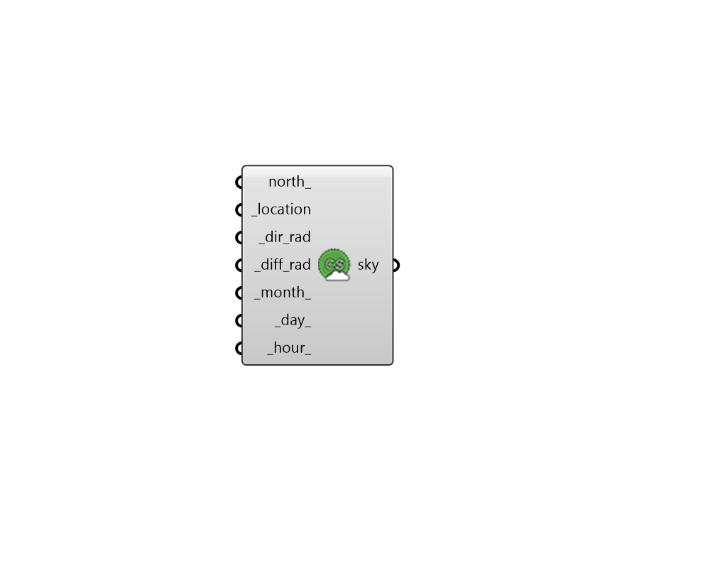

## Custom Sky

 - [[source code]](https://github.com/ladybug-tools/honeybee-grasshopper-radiance/blob/master/honeybee_grasshopper_radiance/src//HB%20Custom%20Sky.py)

Create a Custom sky from direct and diffuse irradiance. 

#### Inputs
* ##### north 
A number between 0 and 360 that represents the degrees off from the y-axis to make North. This can also be a vector to set the North. Default is 0. The default North direction is the Y-axis (0 degrees). 
* ##### location [Required]
A Ladybug location object. 
* ##### dir_rad [Required]
Direct normal irradiance (W/m2). 
* ##### diff_rad [Required]
Diffuse horizontal irradiance (W/m2). 
* ##### month 
An integer between 1 and 12 for the month of the year (default: 6). 
* ##### day 
An integer between 1 and 31 for the day of the month (default: 21). 
* ##### hour 
A number between 0 and 23.999 for the hour of the day (default: 12). 

#### Outputs
* ##### sky
Honeybee sky. You can use this sky to create a daylight recipe. 