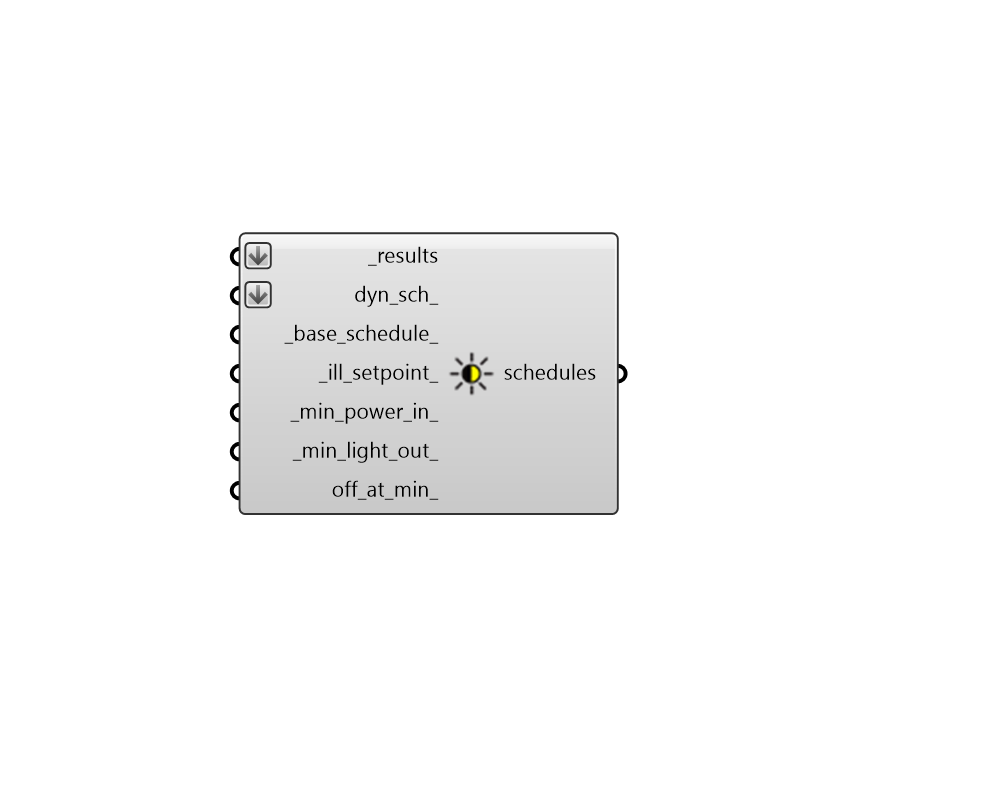

## Daylight Control Schedule

 - [[source code]](https://github.com/ladybug-tools/honeybee-grasshopper-radiance/blob/master/honeybee_grasshopper_radiance/src//HB%20Daylight%20Control%20Schedule.py)

Generate electric lighting schedules from annual daylight results, which can be used to account for daylight controls in energy simulations. 

Such controls will dim the lights in the energy simulation according to whether the illuminance values at the sensor locations are at a target illuminance setpoint. 

In addition to benefiting from the accuracy of Radiance, using this component has several advantages over the "HB Apply Daylight Control" component under HB-Energy. Notably, it can account for setups with multiple illuminance sensors. 

This component will generate one schedule per sensor grid in the simulation. Each grid should have sensors at the locations in space where daylight dimming sensors are located. Grids with one, two, or more sensors can be used to model setups where fractions of each room are controlled by different sensors. If the sensor grids are distributed over the entire floor of the rooms, the resulting schedules will be idealized, where light dimming has been optimized to supply the minimum illuminance setpoint everywhere in the room. 

#### Inputs
* ##### results [Required]
An list of annual Radiance result files from the "HB Annual Daylight" component (containing the .ill files and the sun-up-hours.txt). This can also be just the path to the folder containing these result files. 
* ##### base_schedule 
A lighting schedule representing the usage of lights without any daylight controls. The values of this schedule will be multiplied by the hourly dimming fraction to yield the output lighting schedules. The format of this schedule can be a Ladybug Data Collection, a HB-Energy schedule object, or the identifier of a schedule in the HB-Energy schedule library. If None, a schedule from 9AM to 5PM on weekdays will be used. 
* ##### ill_setpoint 
A number for the illuminance setpoint in lux beyond which electric lights are dimmed if there is sufficient daylight. Some common setpoints are listed below. (Default: 300 lux). 
50 lux - Corridors and hallways. 150 lux - Computer work spaces (screens provide illumination). 300 lux - Paper work spaces (reading from surfaces that need illumination). 500 lux - Retail spaces or museums illuminating merchandise/artifacts. 1000 lux - Operating rooms and workshops where light is needed for safety. 
* ##### min_power_in 
A number between 0 and 1 for the the lowest power the lighting system can dim down to, expressed as a fraction of maximum input power. (Default: 0.3). 
* ##### min_light_out 
A number between 0 and 1 the lowest lighting output the lighting system can dim down to, expressed as a fraction of maximum light output. Note that setting this to 1 means lights aren't dimmed at all until the illuminance setpoint is reached. This can be used to approximate manual light-switching behavior when used in conjunction with the off_at_min_ output below. (Default: 0.2). 
* ##### off_at_min 
Boolean to note whether lights should switch off completely when they get to the minimum power input. (Default: False). 

#### Outputs
* ##### schedules
Lighting control Recipe 