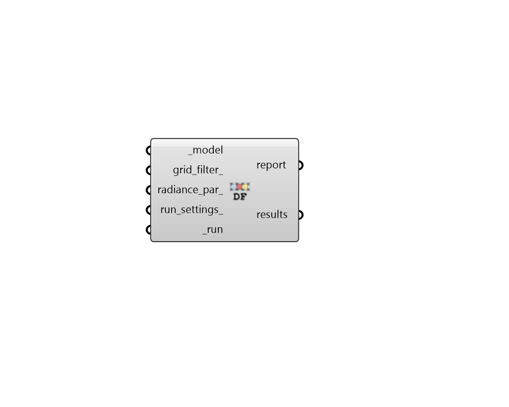

## Daylight Factor

 - [[source code]](https://github.com/ladybug-tools/honeybee-grasshopper-radiance/blob/master/honeybee_grasshopper_radiance/src//HB%20Daylight%20Factor.py)

Run a daylight factor study for a Honeybee model. 

#### Inputs
* ##### model [Required]
A Honeybee Model for which Daylight Factor will be simulated. Note that this model should have grids assigned to it in order to produce meaningfule results. 
* ##### grid_filter 
Text for a grid identifer or a pattern to filter the sensor grids of the model that are simulated. For instance, first_floor_* will simulate only the sensor grids that have an identifier that starts with first_floor_. By default, all grids in the model will be simulated. 
* ##### sensor_count 
Integer for the maximum number of sensor grid points per parallel execution. (Default: 200). 
* ##### radiance_par 
Text for the radiance parameters to be used for ray tracing. (Default: -ab 2 -aa 0.1 -ad 2048 -ar 64). 
* ##### run_settings 
Settings from the "HB Recipe Settings" component that specify how the recipe should be run. This can also be a text string of recipe settings. 
* ##### run [Required]
Set to True to run the recipe and get results. 

#### Outputs
* ##### report
Reports, errors, warnings, etc. 
* ##### results
The daylight factor values from the simulation. 