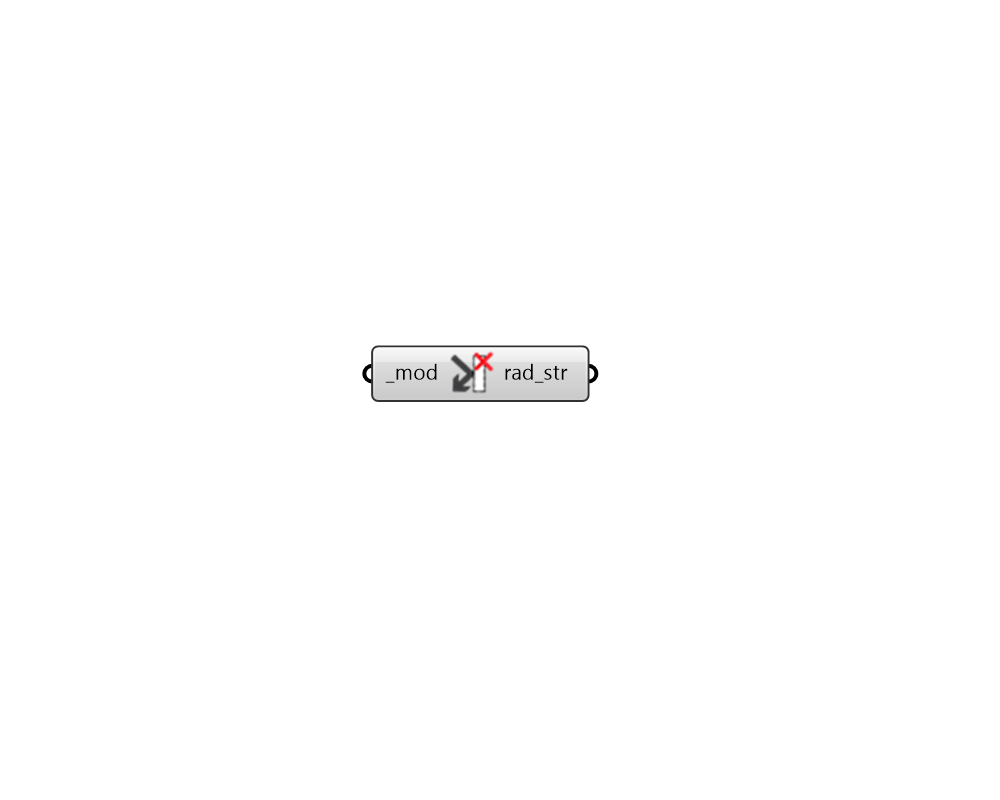

## Deconstruct Modifier

 - [[source code]](https://github.com/ladybug-tools/honeybee-grasshopper-radiance/blob/master/honeybee_grasshopper_radiance/src//HB%20Deconstruct%20Modifier.py)

Deconstruct a modifier into a radiance string. 

#### Inputs
* ##### mod [Required]
A modifier to be deconstructed or text for a modifier to be looked up in the modifier library. 

#### Outputs
* ##### rad_str
A Radiance string that includes all of the attributes that define the modifier. 