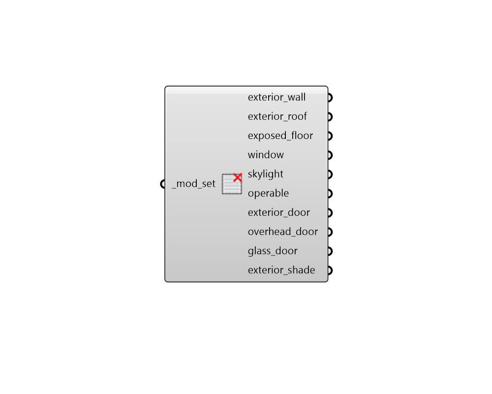

## Deconstruct ModifierSet

 - [[source code]](https://github.com/ladybug-tools/honeybee-grasshopper-radiance/blob/master/honeybee_grasshopper_radiance/src//HB%20Deconstruct%20ModifierSet.py)

Deconstruct a modifier set into its constituient exterior modifiers. 

#### Inputs
* ##### mod_set [Required]
A modifier set to be deconstructed. This can also be text for a modifier set to be looked up in the modifier set library. 

#### Outputs
* ##### exterior_wall
A modifier object for the set's exterior walls. 
* ##### exterior_roof
A modifier object for the set's exterior roofs. 
* ##### exposed_floor
A modifier object for the set's exposed floors. 
* ##### window
A modifier object for apertures with an Outdoors boundary condition and a Wall face type for their parent face. 
* ##### skylight
A modifier object for apertures with an Outdoors boundary condition and a RoofCeiling or Floor face type for their parent face. 
* ##### operable
A modifier object for apertures with an Outdoors boundary condition and True is_operable property. 
* ##### exterior_door
A modifier object for opaque doors with an Outdoors boundary condition and a Wall face type for their parent face. 
* ##### overhead_door
A modifier object for opaque doors with an Outdoors boundary condition and a RoofCeiling or Floor face type for their parent face. 
* ##### glass_door
A modifier object for all glass doors with an Outdoors boundary condition. 
* ##### exterior_shade
A modifier object for all exterior shades. 