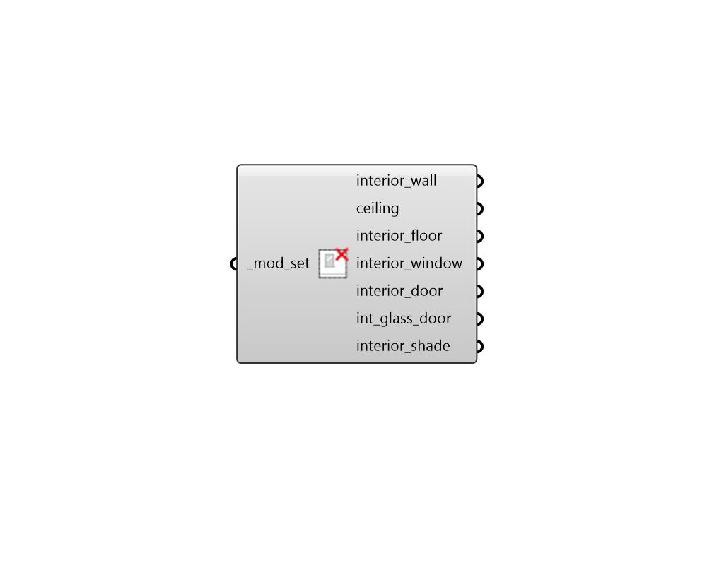

## Deconstruct ModifierSet Interior

 - [[source code]](https://github.com/ladybug-tools/honeybee-grasshopper-radiance/blob/master/honeybee_grasshopper_radiance/src//HB%20Deconstruct%20ModifierSet%20Interior.py)

Deconstruct a modifier set into its constituient interior modifiers. 

#### Inputs
* ##### mod_set [Required]
A modifier set to be deconstructed. This can also be text for a modifier set to be looked up in the modifier set library. 

#### Outputs
* ##### interior_wall
A modifier object for the set's interior walls. 
* ##### ceiling
A modifier object for the set's interior roofs. 
* ##### interior_floor
A modifier object for the set's interior floors. 
* ##### interior_window
A modifier object for all apertures with a Surface boundary condition. 
* ##### interior_door
A modifier object for all opaque doors with a Surface boundary condition. 
* ##### int_glass_door
A modifier object for all glass doors with a Surface boundary condition. 
* ##### interior_shade
A modifier object for all interior shades. 