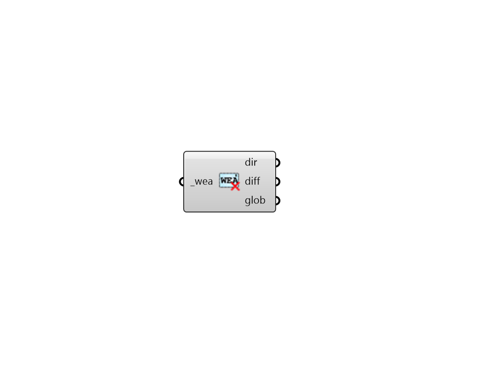

## Deconstruct Wea

 - [[source code]](https://github.com/ladybug-tools/honeybee-grasshopper-radiance/blob/master/honeybee_grasshopper_radiance/src//HB%20Deconstruct%20Wea.py)

Deconstruct a Wea object into data collections of direct, diffuse, and golbal irradiance at each timestep of the file. 

#### Inputs
* ##### wea [Required]
A Honeybee WEA object. 

#### Outputs
* ##### dir
A data collection of direct normal irradiance values at each timestep of the Wea. 
* ##### diff
A data collection of diffuse sky solar irradiance values at each timestep of the Wea. 
* ##### glob
A data collection of global horizontal irradiance values at each timestep of the Wea. 