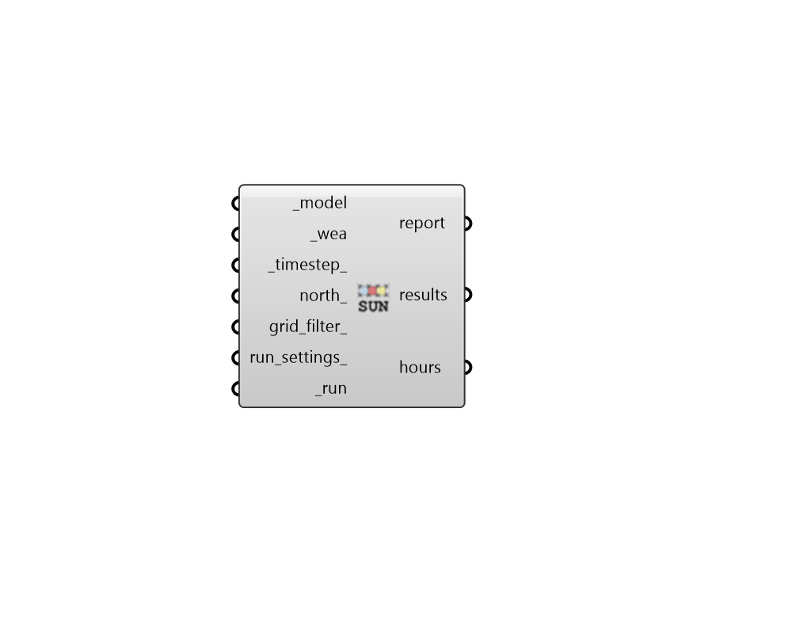

## Direct Sun Hours

 - [[source code]](https://github.com/ladybug-tools/honeybee-grasshopper-radiance/blob/master/honeybee_grasshopper_radiance/src//HB%20Direct%20Sun%20Hours.py)

Calculate the number of hours of direct sun received by grids of sensors in a Honeybee model. 

The fundamental calculation of this recipe is the same as that of the "LB Direct Sun Hours" component except that this recipe uses Radiance, which allows the simulation to scale better for large numbers of sensors. 

#### Inputs
* ##### model [Required]
A Honeybee Model for which Direct Sun Hours will be simulated. Note that this model should have grids assigned to it in order to produce meaningfule results. 
* ##### wea [Required]
A Wea object produced from the Wea components that are under the Light Sources tab. This can also be the path to a .wea or a .epw file. 
* ##### timestep 
An integer for the timestep of the inpput _wea. This value will be used to ensure the units of the results are in hours. (Default: 1) 
* ##### north 
A number between -360 and 360 for the counterclockwise difference between the North and the positive Y-axis in degrees. This can also be Vector for the direction to North. (Default: 0). 
* ##### grid_filter 
Text for a grid identifer or a pattern to filter the sensor grids of the model that are simulated. For instance, first_floor_* will simulate only the sensor grids that have an identifier that starts with first_floor_. By default, all grids in the model will be simulated. 
* ##### run_settings 
Settings from the "HB Recipe Settings" component that specify how the recipe should be run. This can also be a text string of recipe settings. 
* ##### run [Required]
Set to True to run the recipe and get results. This input can also be the integer "2" to run the recipe silently. 

#### Outputs
* ##### report
Reports, errors, warnings, etc. 
* ##### results
Raw result files (.ill) that contain matrices of zero/one values indicating whether each sensor is exposed to the sun at a given time step of the input Wea. 
* ##### hours
The cumulative number of hours that each sensor can see the sun. Each value is always in hours provided that the input _timestep_ is the same as the input Wea. 