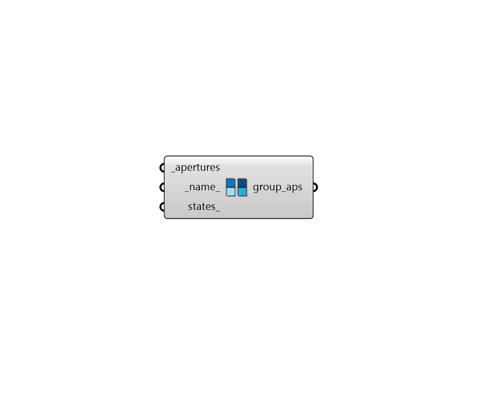

## Dynamic Aperture Group

 - [[source code]](https://github.com/ladybug-tools/honeybee-grasshopper-radiance/blob/master/honeybee_grasshopper_radiance/src//HB%20Dynamic%20Aperture%20Group.py)

Combine Honeybee Apertures into a single dynamic group. Apertures that are a part of the same dynamic group will have their states change in unison. If an aperture has no dynamic group, it is assumed to be static. 

This component can also be used to combine apertures that already have states assigned to them into one group since existing states are not overwritten if nothing is connected to states_. In this case, the total number of states in the dynamic group is equal to that of the object with the highest number of states. After a dynamic aperture with fewer states than that of it's dynamic group has hit its highest state, it remains in that state as the other dynamic apertures continue to change. 

#### Inputs
* ##### apertures [Required]
A list of Honeybee Apertures to be grouped together into a single dynamic group. Door objects can also be connected here to be included in the group. 
* ##### name 
Text to be incorporated into a unique identifier for the dynamic Aperture group. If the name is not provided, a random name will be assigned. 
* ##### states 
An optional list of Honeybee State objects ordered based on how they will be switched on. The first state is the default state and, typically, higher states are more shaded. If the objects in the group have no states, the modifiers already assigned the apertures will be used for all states. 

#### Outputs
* ##### group_aps
Honeybee apertures that are a part of the same dynamic group. These can be used directly in radiance simulations or can be added to Honeybee faces and rooms. 