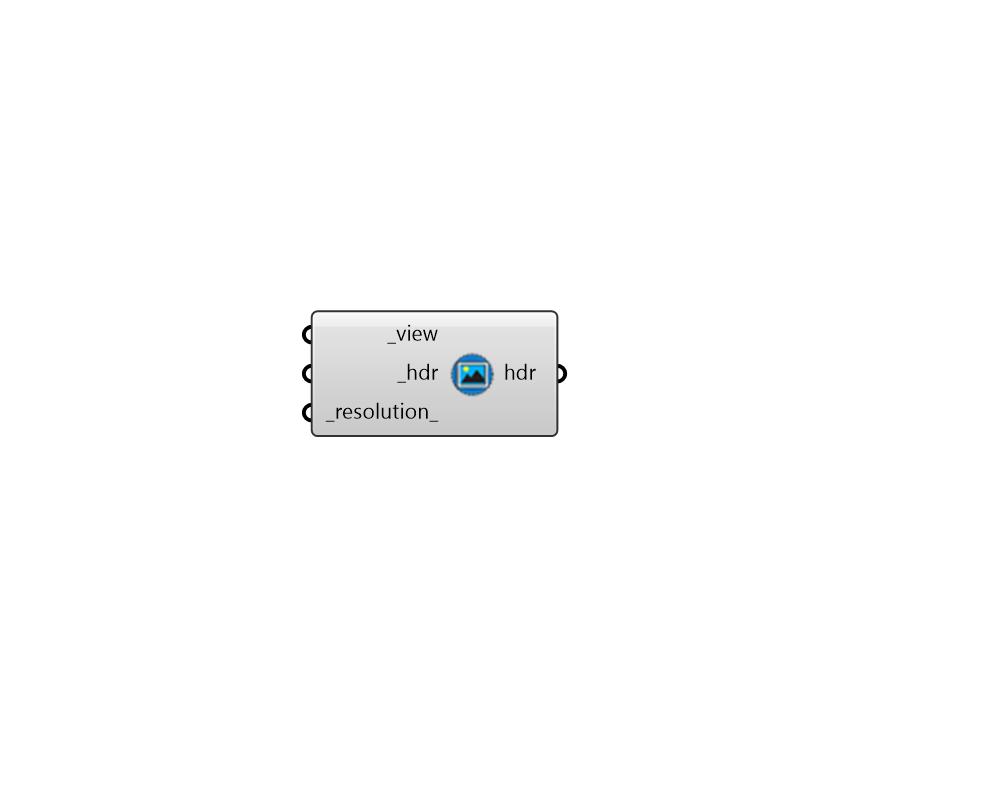

## Extract HDR

 - [[source code]](https://github.com/ladybug-tools/honeybee-grasshopper-radiance/blob/master/honeybee_grasshopper_radiance/src//HB%20Extract%20HDR.py)

Interpolate or extrapolate a High Dynamic Range (HDR) image file from another HDR image file. 

Recommended use is to extract 180 FOV (-vh 180 -vv 180) angular or hemispherical HDR images from a 360 FOV (-vh 360 -vv 360) angular HDR image. Alternatively, conversions between 180 FOV angular and hemispherical HDR images can be made. 

#### Inputs
* ##### view [Required]
A view to interpolate or extrapolate into a new HDR. The "HB View"  component can be used to create an input view and it must have the same position as that use to make the _hdr. 
* ##### hdr [Required]
Path to a High Dynamic Range (HDR) image file from which to interpolate or extrapolate. 
* ##### resolution 
An integer for the dimension of the output image in pixels. If extracting a 180 FOV angular or hemispherical HDR image from a 360 FOV HDR image, the default resolution is 1/3 of the resolution of _hdr. If converting between 180 FOV angular or hemispherical HDR images, the default resolution is that of _hdr. 

#### Outputs
* ##### hdr
Path to the resulting HDR image file. 