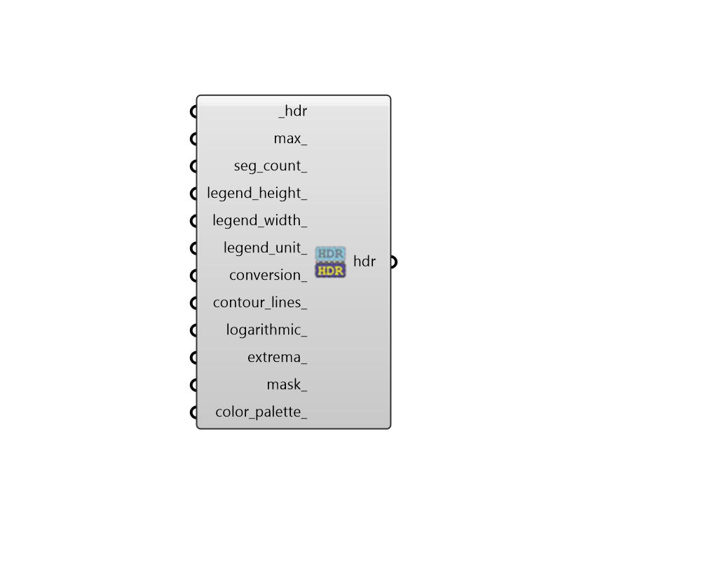

## False Color

 - [[source code]](https://github.com/ladybug-tools/honeybee-grasshopper-radiance/blob/master/honeybee_grasshopper_radiance/src//HB%20False%20Color.py)

Convert a High Dynamic Range (HDR) image file into a falsecolor version of itself. 

#### Inputs
* ##### hdr [Required]
Path to a High Dynamic Range (HDR) image file. 
* ##### max 
A number to set the upper boundary of the legend. The default is dictated based on the legend_unit_. 
* ##### seg_count 
An interger representing the number of steps between the high and low boundary of the legend. The default is set to 10 and any custom values input in here should always be greater than or equal to 2. 
* ##### legend_height 
An integer for the height of the legend in pixels. Set to 0 to completely remove the legend from the output. (Default: 200). 
* ##### legend_width 
An integer for the width of the legend in pixels. Set to 0 to completely remove the legend from the output. (Default: 100). 
* ##### legend_unit 
Text for the unit of the legend. If unspecified, an attempt will be made to sense the metric from the input image file. Typical examples include lux, W/m2, cd/m2, w/sr-m2. 
* ##### conversion 
Number for the conversion factor (aka. multiplier) for the results. The default is either 1 or 179 depending on whether the image is for radiance or irradiance to luminance or illuminance, respectively. 
* ##### contour_lines 
Set to True ro render the image with colored contour lines. 
* ##### logarithmic 
Number of decades to use with a logarithmic legend scale. Decades are the number of intervals of 10 below the maximum scale. If unspecified, a linear scale is used. 
* ##### extrema 
Set to True to cause extrema points to be printed on the brightest and darkest pixels of the input picture. 
* ##### mask 
A boolen to note whether pixels with a value of zero should be masked in black. (Default: False). 
* ##### color_palette 
Optional interger or text to change the color palette. Choose from the following. 

    * 0 = def - default colors

    * 1 = pm3d -  a variation of the default colors

    * 2 = spec - the old spectral mapping

    * 3 = hot - a thermal scale

#### Outputs
* ##### hdr
Path to the resulting falsecolor HDR file. This can be plugged into the Ladybug "Image Viewer" component to preview the image. It can also be plugged into the "HB HDR to GIF" component to get a GIF image that is more portable and easily previewed by different software. 