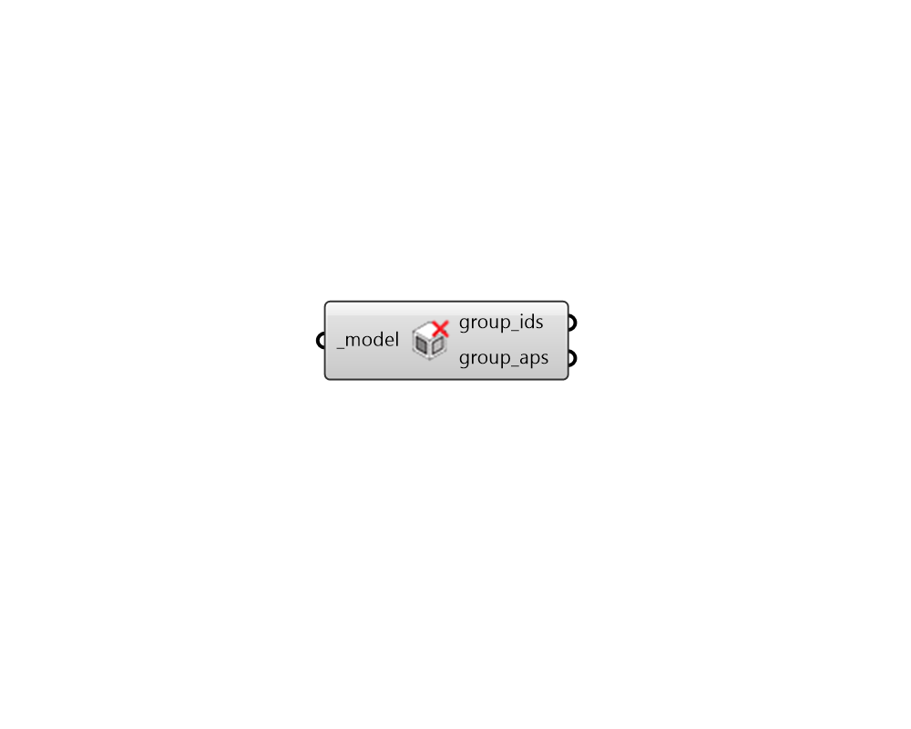

## Get Dynamic Groups

 - [[source code]](https://github.com/ladybug-tools/honeybee-grasshopper-radiance/blob/master/honeybee_grasshopper_radiance/src//HB%20Get%20Dynamic%20Groups.py)

Get all of the Dynamic Radiance Groups assigned to a Model. 

#### Inputs
* ##### model [Required]
A Honeybee Model for which dynamic groups will be output. 

#### Outputs
* ##### group_ids
The identifiers of the dynamic groups assigned to the Model. 
* ##### group_aps
A data tree of Dynamic Apertures in the Model. Each branch of the tree represents a different Dynamic Aperture Group and corresponds to the group_ids above. The data tree can be exploded with the native Grasshopper "Explod Tree" component to assign schedules to each Dynamic Group for postprocessing. 