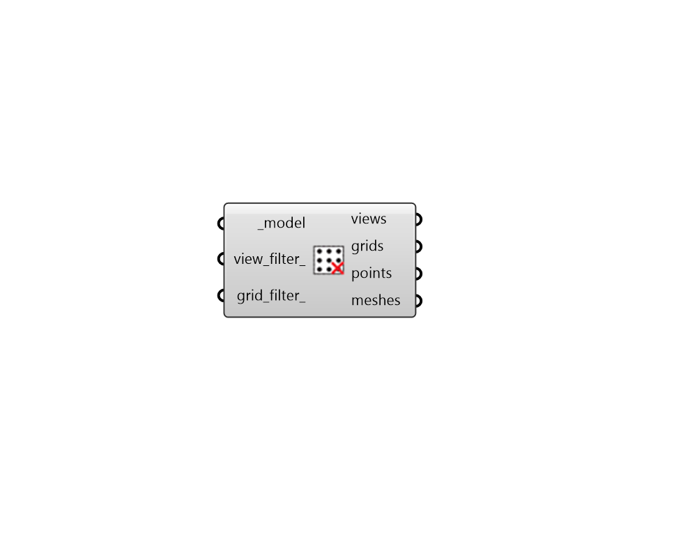

## Get Grids and Views

 - [[source code]](https://github.com/ladybug-tools/honeybee-grasshopper-radiance/blob/master/honeybee_grasshopper_radiance/src//HB%20Get%20Grids%20and%20Views.py)

Get Radiance Sensor Grids and/or Views from a Honeybee Model and visualize them in the Rhino scene. 

#### Inputs
* ##### model [Required]
A Honeybee Model for which grids and views will be output. 
* ##### view_filter 
Text for a view identifer or a pattern to filter the views of the model that are output. For instance, `first_floor_*` will simulate only the views that have an identifier that starts with `first_floor_`. By default, all views in the model will be output. 
* ##### grid_filter 
Text for a grid identifer or a pattern to filter the sensor grids of the model that are output. For instance, first_floor_* will simulate only the sensor grids that have an identifier that starts with first_floor_. By default, all grids in the model will be output. 

#### Outputs
* ##### views
A list of Honeybee-Radiance Views that are assigned to the input _model. 
* ##### grids
A list of Honeybee-Radiance SensorGrids that are assigned to the input _model. 
* ##### points
The points that are at the center of each grid cell. 
* ##### meshes
Mesh for each sensor grid, which can be passed to the "LB Spatial Heatmap" component. 