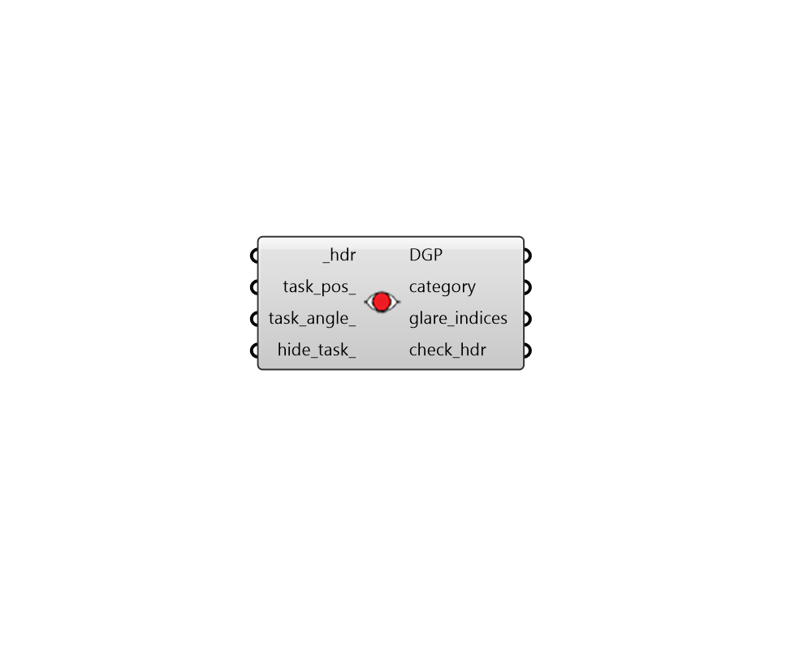

## Glare Postprocess

 - [[source code]](https://github.com/ladybug-tools/honeybee-grasshopper-radiance/blob/master/honeybee_grasshopper_radiance/src//HB%20Glare%20Postprocess.py)

Perform glare post-processing on a hemisphical fisheye HDR image file. 

Glare post-processing includes calcuating Daylight Glare Probability (DGP) as well as other glare indexes (DGI, UGR, VCP, CGI, UDP). 

This component is using the `evalglare` function for glare calculations., which is developed by J. Wienold at Fraunhofer ISE. More information on evalglare can be found here: https://www.radiance-online.org/learning/documentation/manual-pages/pdfs/evalglare.pdf/view 

For more information about the metrics used to evaluate glare, see here: http://web.mit.edu/tito_/www/Projects/Glare/GlareRecommendationsForPractice.html 

#### Inputs
* ##### hdr [Required]
Path to a hemisphical fisheye High Dynamic Range (HDR) image file. This can be obtained from the "HB Point-In-Time View-Based" recipe component. Due to runtime reasons of the evalglare code, the input HDR image should be smaller than 1500 x 1500 pixels. The recommended size is 1000 x 1000 pixels, the minimum recommended size is 800 x 800 pixels. 
* ##### task_pos 
An optional task position as a 2D point or string formatted as "X, Y". The X and Y coordinates of this point must be numbers between 0 and 1 and correspond to fraction of the image width and height where the task position lies. If no task position is provided, the glare will be valuated for the entire scene of the image. 
* ##### task_angle 
An number between 0 and 180 for the task position opening angle in degrees. This angle indicates how widely the peripheral vision is engaged for the task. (Default: 30). 
* ##### hide_task 
Boolean to note whether the task area should be hidden in the output check_hdr. 

#### Outputs
* ##### DGP
Daylight Glare Probability (DGP) as a number between 0 and 1. The DGP describes the fraction of persons disturbed by glare, where 0 is no one disturbed and 1 is everyone. Values lower than 0.2 are out of the range of the user assessment tests, where the program is based on and should be interpreted carefully. 
* ##### category
Text for the category of glare discomfort. It will be one of the following. 

    * Imperceptible Glare [0.35 > DGP]

    * Perceptible Glare [0.4 > DGP >= 0.35]

    * Disturbing Glare [0.45 > DGP >= 0.4]

    * Intolerable Glare [DGP >= 0.45]
* ##### glare_indices
A list of various glare indices ordered as follows. 

    * Daylight Glare Index (DGI)

    * Unified Glare Rating (UGR)

    * Visual Comfort Probability (VCP)

    * CIE Glare Index (CGI)

    * Veiling Luminance (Lveil)
* ##### check_hdr
Path to a HDR image produced from the glare study. The image will use randomly-assigned colors to indicate different sources of glare in the image. It will also show a circular region for the task area unless hide_task_ has been set to True. 