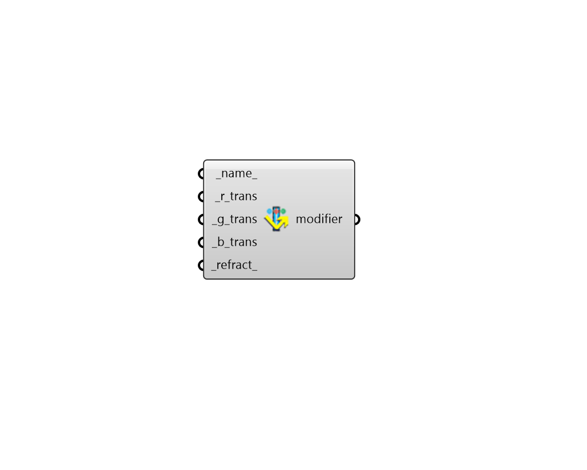

## Glass Modifier 3

 - [[source code]](https://github.com/ladybug-tools/honeybee-grasshopper-radiance/blob/master/honeybee_grasshopper_radiance/src//HB%20Glass%20Modifier%203.py)

Create an glass radiance modifier from a red, green, and blue transmittances 

#### Inputs
* ##### name 
Text to set the name for the modifier and to be incorporated into a unique modifier identifier. 
* ##### r_trans [Required]
A number between 0 and 1 for the transmittance of the red channel. (Default: 0). 
* ##### g_trans [Required]
A number between 0 and 1 for the transmittance of the green channel. (Default: 0). 
* ##### b_trans [Required]
A number between 0 and 1 for the transmittance of the blue channel. (Default: 0). 
* ##### refract 
Index of refraction. Typical values are 1.52 for float glass and 1.4 for ETFE. If None, Radiance will default to using 1.52 for glass (Default: None). 

#### Outputs
* ##### modifier
A glass modifier that can be assigned to a Honeybee geometry or Modifier Sets. 