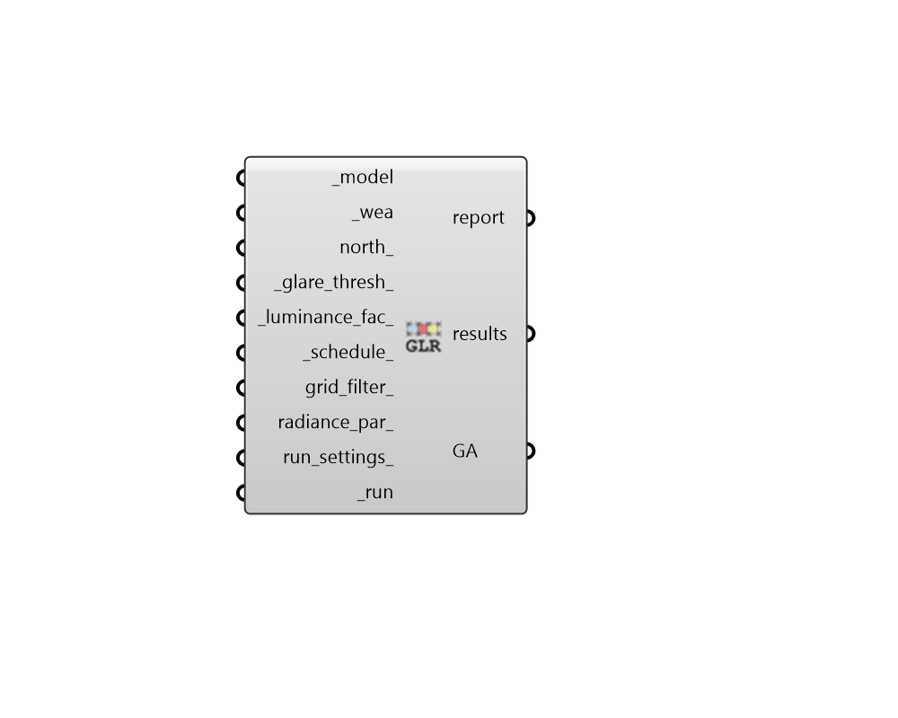

## Imageless Annual Glare

 - [[source code]](https://github.com/ladybug-tools/honeybee-grasshopper-radiance/blob/master/honeybee_grasshopper_radiance/src//HB%20Imageless%20Annual%20Glare.py)

Run an annual glare study for a Honeybee model to compute hourly Daylight Glare Probability (DGP) for each sensor in a model's sensor grids. 

This recipe uses the image-less glare method developed by Nathaniel Jones to estimate glare at each sensor. More information on this method can be found here: https://github.com/nljones/Accelerad/wiki/The-Imageless-Method-for-Spatial-and-Annual-Glare-Analysis 

The resulting DGP is used to compute Glare Autonomy (GA), which is the percentage of occupied time that a view is free of glare. 

#### Inputs
* ##### model [Required]
A Honeybee Model for which Annual Daylight Glare Probability (DGP) will be simulated. Note that this model must have grids assigned to it and, typically, these are radial grids created using the "radial grid" components. 
* ##### wea [Required]
A Wea object produced from the Wea components that are under the Light Sources tab. This can also be the path to a .wea or a .epw file. Note that the Wea must have a timestep of 1 to be used with this recipe. 
* ##### north 
A number between -360 and 360 for the counterclockwise difference between the North and the positive Y-axis in degrees. This can also be Vector for the direction to North. (Default: 0). 
* ##### glare_thresh 
A fractional number for the threshold of DGP above which conditions are considered to induce glare. This value is used when calculating glare autonomy, which is the percent of hours in which the view is free of glare. (Default: 0.4 for disturbing or intolerable glare). 
* ##### luminance_fac 
Luminance factor in cd/m2. If the sky patch brightness is above this factor it will act as a glare source. (Default: 2000). 
* ##### schedule 
An annual occupancy schedule, either as a Ladybug Hourly Continuous Data Collection or a HB-Energy schedule object. This can also be the path to a CSV file with 8760 rows or the identifier of a schedule in the honeybee-energy schedule library. Any value in this schedule that is 0.1 or above will be considered occupied. 
* ##### grid_filter 
Text for a grid identifer or a pattern to filter the sensor grids of the model that are simulated. For instance, first_floor_* will simulate only the sensor grids that have an identifier that starts with first_floor_. By default, all grids in the model will be simulated. 
* ##### radiance_par 
Text for the radiance parameters to be used for ray tracing. (Default: -ab 2 -ad 5000 -lw 2e-05). 
* ##### run_settings 
Settings from the "HB Recipe Settings" component that specify how the recipe should be run. This can also be a text string of recipe settings. 
* ##### run [Required]
Set to True to run the recipe and get results. This input can also be the integer "2" to run the recipe silently. 

#### Outputs
* ##### report
Reports, errors, warnings, etc. 
* ##### results
Raw result files (.dgp) that contain Daylight Glare Probability (DGP) matrices for each sensor at each hour of the simulation. These can be postprocessed using various components under the 4::Results sub-tab. 
* ##### GA
Glare Autonomy (GA) results in percent. GA is the percentage of occupied hours that each view is free of glare (with a DGP below the glare threshold). These can be plugged into the "LB Spatial Heatmap" component along with meshes of the sensor grids to visualize results. 