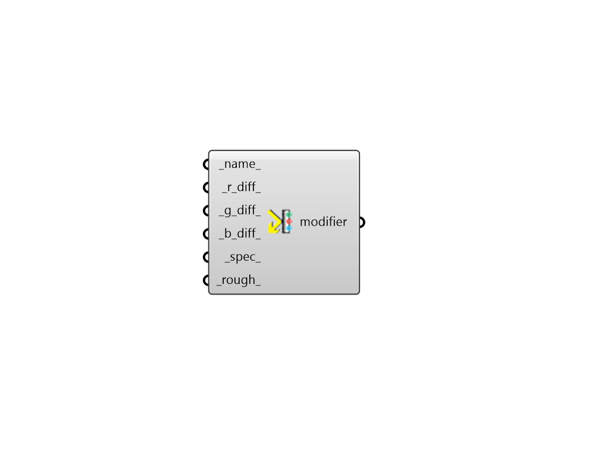

## Metal Modifier 3

 - [[source code]](https://github.com/ladybug-tools/honeybee-grasshopper-radiance/blob/master/honeybee_grasshopper_radiance/src//HB%20Metal%20Modifier%203.py)

Create a metal radiance modifier from red, green, and blue reflectances. 

#### Inputs
* ##### name 
Text to set the name for the modifier and to be incorporated into a unique modifier identifier. 
* ##### r_diff 
A number between 0 and 1 for the absolute diffuse red reflectance. (Default: 0). 
* ##### g_diff 
A number between 0 and 1 for the absolute diffuse green reflectance. (Default: 0). 
* ##### b_diff 
A number between 0 and 1 for the absolute diffuse blue reflectance. (Default: 0). 
* ##### spec 
A number between 0 and 1 for the absolute specular reflectance of the modifier. Note that the sum of this value and the diffuse should be less than one. Specularity of metals is usually 0.9 or greater. (Default: 0.9) 
* ##### rough 
Roughness is specified as the rms slope of surface facets. A value of 0 corresponds to a perfectly smooth surface, and a value of 1 would be a very rough surface. Roughness values greater than 0.2 are not very realistic. (Default: 0). 

#### Outputs
* ##### modifier
A metal modifier that can be assigned to a Honeybee geometry or Modifier Sets. 