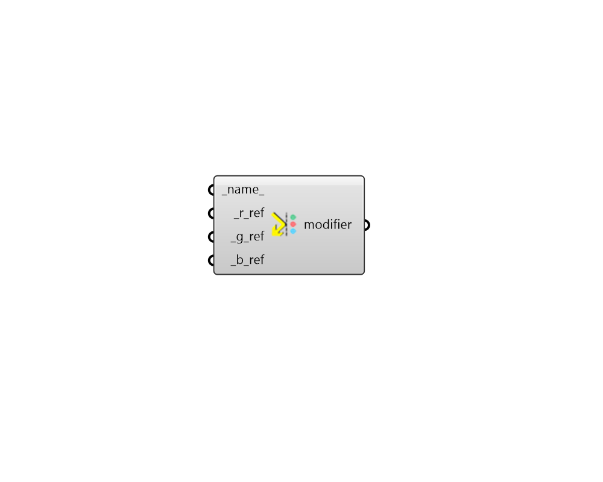

## Mirror Modifier 3

 - [[source code]](https://github.com/ladybug-tools/honeybee-grasshopper-radiance/blob/master/honeybee_grasshopper_radiance/src//HB%20Mirror%20Modifier%203.py)

Create an mirror radiance modifier from a single reflectance. 

#### Inputs
* ##### name 
Text to set the name for the modifier and to be incorporated into a unique modifier identifier. 
* ##### r_ref [Required]
A number between 0 and 1 for the red reflectance. 
* ##### g_ref [Required]
A number between 0 and 1 for the green reflectance. 
* ##### b_ref [Required]
A number between 0 and 1 for the blue reflectance. 

#### Outputs
* ##### modifier
An mirror modifier that can be assigned to a Honeybee geometry or Modifier Sets. 