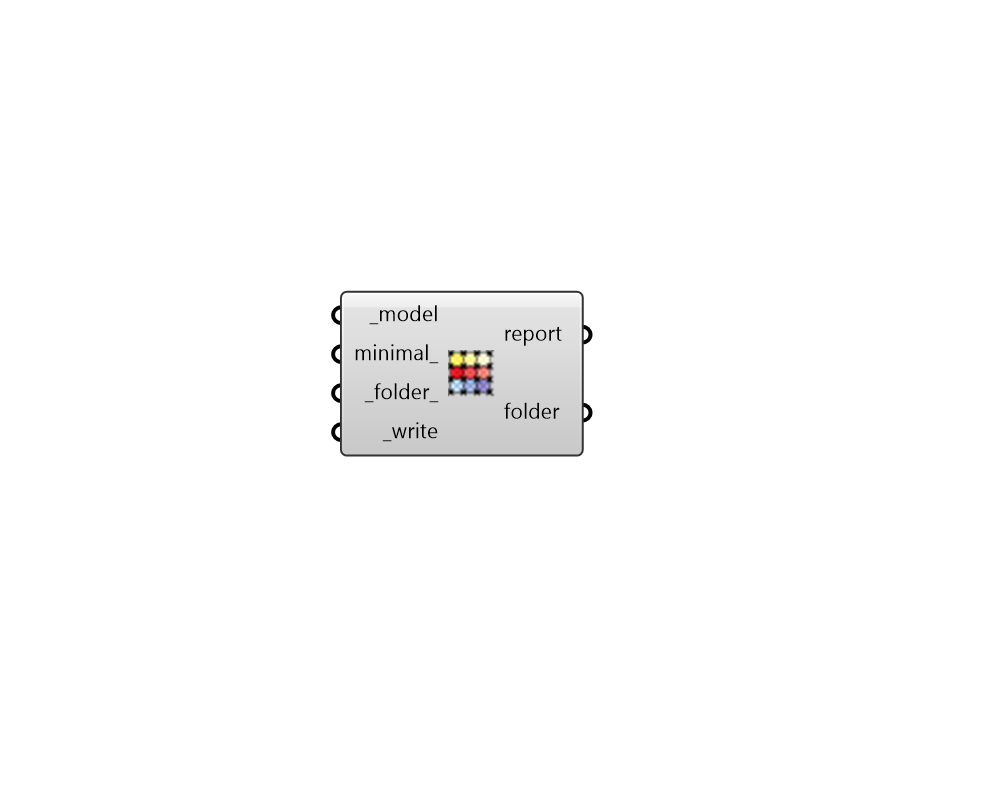

## Model to Rad Folder

 - [[source code]](https://github.com/ladybug-tools/honeybee-grasshopper-radiance/blob/master/honeybee_grasshopper_radiance/src//HB%20Model%20to%20Rad%20Folder.py)

Write a Honeybee Model to a Radiance Model Folder. 

This Radiance Model Folder is what is used to run various types of Radiance studies off of a consistent set of geometry and modifiers. 

#### Inputs
* ##### model [Required]
A honeybee model object possessing all geometry, radiance modifiers and simulation assets like Sensor Grids and Views. 
* ##### folder 
Path to a folder to into which the Model Radiance Folder will be written. If unspecified, it will be written to a sub-folder within the default simulation folder. 
* ##### write [Required]
Set to True to write the Model to a Radiance folder. 

#### Outputs
* ##### report
Reports, errors, warnings, etc. 
* ##### folder
Path to the folder in which all of the files have been written. 