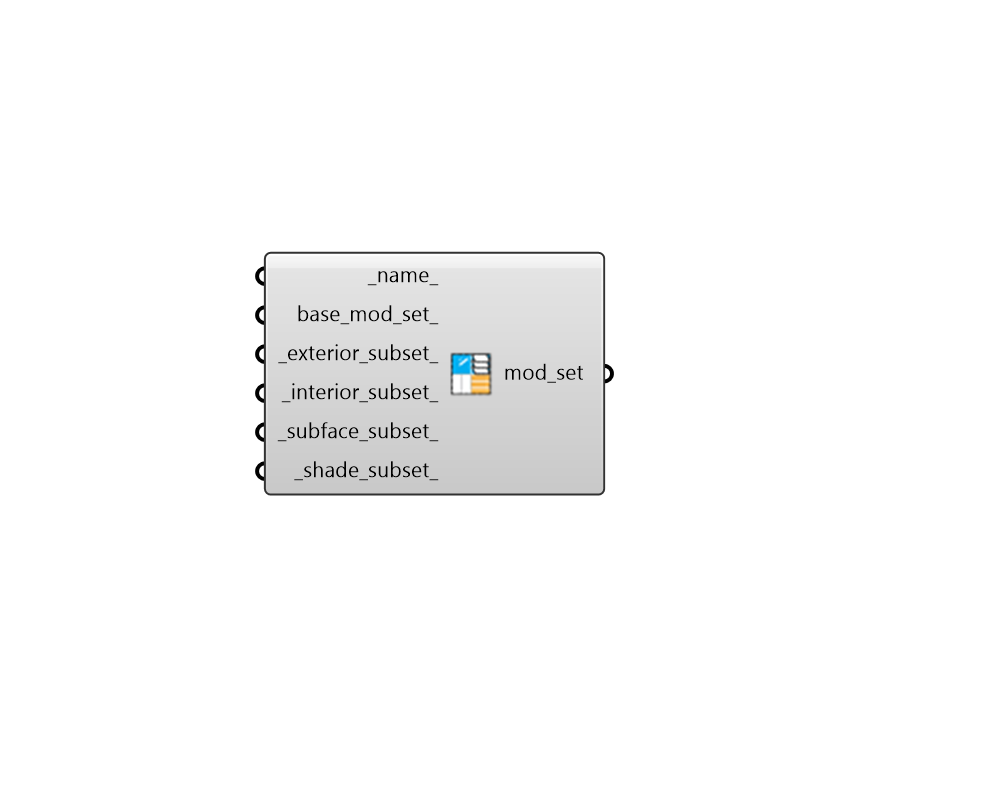

## ModifierSet

 - [[source code]](https://github.com/ladybug-tools/honeybee-grasshopper-radiance/blob/master/honeybee_grasshopper_radiance/src//HB%20ModifierSet.py)

Create a ModifierSet object containing all radiance modifiers needed to create an radiance model. ModifierSets can be assigned to Honeybee Rooms to specify all default modifiers on the Room. 

#### Inputs
* ##### name 
Text to set the name for the ModifierSet and to be incorporated into a unique ModifierSet identifier. If None, a random one will be genrated. 
* ##### base_mod_set 
An optional ModifierSet object that will be used as the starting point for the new ModifierSet output from this component. This can also be text for the name of a ModifierSet within the library such as that output from the "HB Search Modifier Sets" component. If None, the Honeybee "Generic Default Modifier Set" will be used as the base. 
* ##### exterior_subset 
A modifier subset list from the "HB Exterior Modifier Subset" component. Note that None values in this list correspond to no change to the given modifier in the base_mod_set_. 
* ##### interior_subset 
A modifier subset list from the "HB Interior Modifier Subset" component. Note that None values in this list correspond to no change to the given modifier in the base_mod_set_. 
* ##### subface_subset 
A modifier subset list from the "HB Subface Subset" component. Note that None values in this list correspond to no change to the given modifier in the base_mod_set_. 
* ##### shade_subset 
A modifier subset list from the "HB Shade Modifier Subset" component. Note that None values in this list correspond to no change to the given modifier in the base_mod_set_. 

#### Outputs
* ##### mod_set
A ModifierSet object that can be assigned to Honeybee Rooms in order to specify all default modifiers on the Room. 