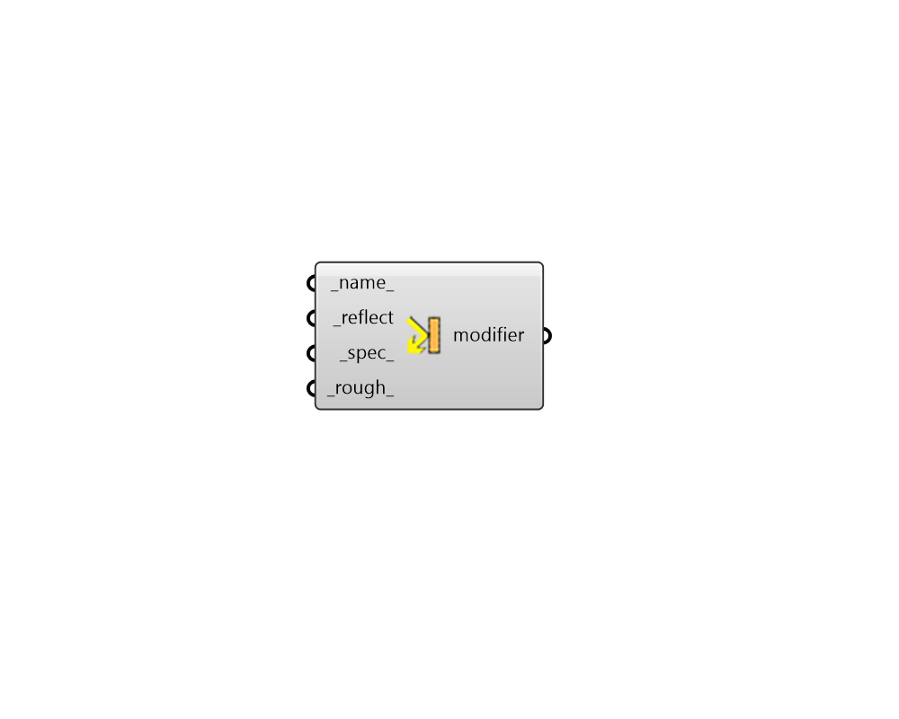

## Opaque Modifier

 - [[source code]](https://github.com/ladybug-tools/honeybee-grasshopper-radiance/blob/master/honeybee_grasshopper_radiance/src//HB%20Opaque%20Modifier.py)

Create an opaque radiance modifier from a single reflectance. 

#### Inputs
* ##### name 
Text to set the name for the modifier and to be incorporated into a unique modifier identifier. 
* ##### reflect [Required]
A number between 0 and 1 for the absolute diffuse reflectance of the modifier. This reflectance will be the same for the red, green and blue channels. 
* ##### spec 
A number between 0 and 1 for the absolute specular reflectance of the modifier. Note that the sum of this value and the diffuse _reflect should be less than one. Specular reflectances greater than 0.1 are rare for non-metallic materials. (Default: 0). 
* ##### rough 
Roughness is specified as the rms slope of surface facets. A value of 0 corresponds to a perfectly smooth surface, and a value of 1 would be a very rough surface. Roughness values greater than 0.2 are not very realistic. (Default: 0). 

#### Outputs
* ##### modifier
An opaque modifier that can be assigned to a Honeybee geometry or Modifier Sets. 