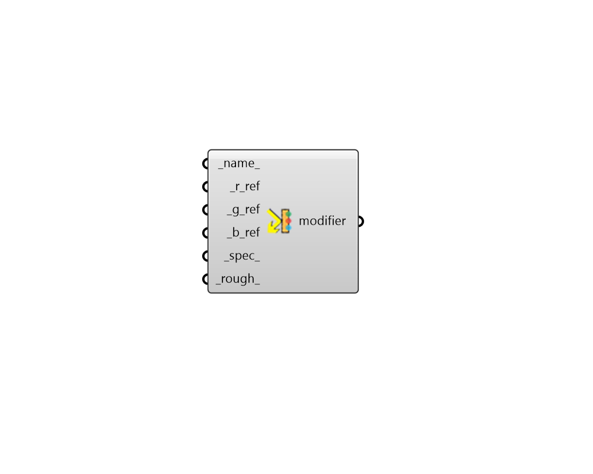

## Opaque Modifier 3

 - [[source code]](https://github.com/ladybug-tools/honeybee-grasshopper-radiance/blob/master/honeybee_grasshopper_radiance/src//HB%20Opaque%20Modifier%203.py)

Create an opaque radiance modifier from red, green, and blue reflectances. 

#### Inputs
* ##### name 
Text to set the name for the modifier and to be incorporated into a unique modifier identifier. 
* ##### r_ref [Required]
A number between 0 and 1 for the red reflectance. 
* ##### g_ref [Required]
A number between 0 and 1 for the green reflectance. 
* ##### b_ref [Required]
A number between 0 and 1 for the blue reflectance. 
* ##### spec 
A number between 0 and 1 for the fraction of specularity. Specularity fractions greater than 0.1 are not common in non-metallic materials. (Default: 0). 
* ##### rough 
Roughness is specified as the rms slope of surface facets. A value of 0 corresponds to a perfectly smooth surface, and a value of 1 would be a very rough surface. Roughness values greater than 0.2 are not very realistic. (Default: 0). 

#### Outputs
* ##### modifier
An opaque modifier that can be assigned to a Honeybee geometry or Modifier Sets. 