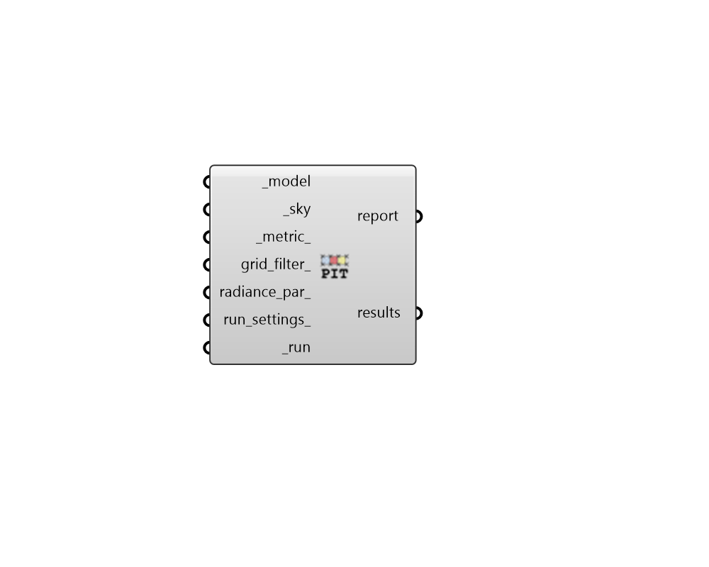

## Point-In-Time Grid-Based

 - [[source code]](https://github.com/ladybug-tools/honeybee-grasshopper-radiance/blob/master/honeybee_grasshopper_radiance/src//HB%20Point-In-Time%20Grid-Based.py)

Run a point-in-time grid-based study for a Honeybee model. 

Point-in-time recipes require a sky and can output illuminance, irradiance, luminance or radiance. 

#### Inputs
* ##### model [Required]
A Honeybee Model for which a point-in-time grid-based study will be run. Note that this model should have grids assigned to it in order to produce meaningfule results. 
* ##### sky [Required]
A Radiance sky from any of the sky components under the "Light Sources" tab. Skies can be either CIE, ClimateBased/Custom, or for a specific Illuminance/Irradiance. This input can also just be a text definition of a sky's paramters. Examples include: 

    * cie 21 Mar 9:00 -lat 41.78 -lon -87.75 -tz 5 -type 0

    * climate-based 21 Jun 12:00 -lat 41.78 -lon -87.75 -tz 5 -dni 800 -dhi 120

    * irradiance 0
* ##### metric 
Either an integer or the full name of a point-in-time metric to be computed by the recipe. (Default: illuminance). Choose from the following: 

    * 0 = illuminance

    * 1 = irradiance

    * 2 = luminance

    * 3 = radiance
* ##### grid_filter 
Text for a grid identifer or a pattern to filter the sensor grids of the model that are simulated. For instance, `first_floor_*` will simulate only the sensor grids that have an identifier that starts with `first_floor_`. By default, all grids in the model will be simulated. 
* ##### radiance_par 
Text for the radiance parameters to be used for ray tracing. (Default: -ab 2 -aa 0.1 -ad 2048 -ar 64). 
* ##### run_settings 
Settings from the "HB Recipe Settings" component that specify how the recipe should be run. This can also be a text string of recipe settings. 
* ##### run [Required]
Set to True to run the recipe and get results. This input can also be the integer "2" to run the recipe silently. 

#### Outputs
* ##### report
Reports, errors, warnings, etc. 
* ##### results
Numbers for the point-in-time value at each sensor. Values are in the standard SI units of the requested input metric. These can be plugged into the "LB Spatial Heatmap" component along with meshes of the sensor grids to visualize results. 

    * illuminance = lux (aka. lm/m2)

    * irradiance = W/m2

    * luminance = cd/m2 (aka. lm/m2-sr)

    * radiance = W/m2-sr